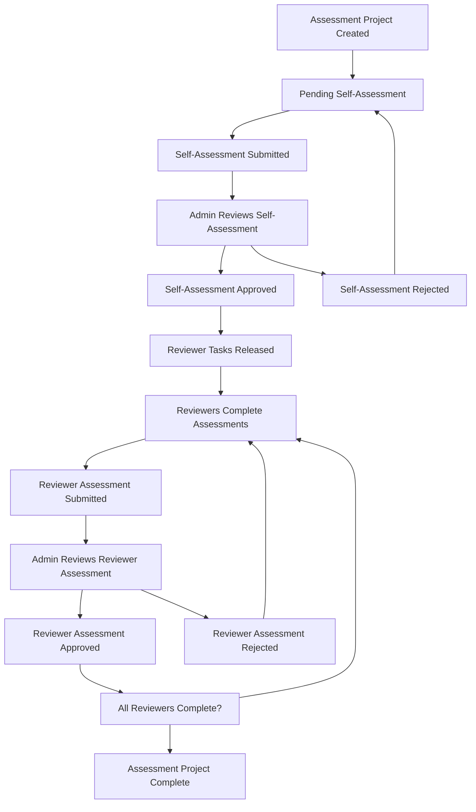
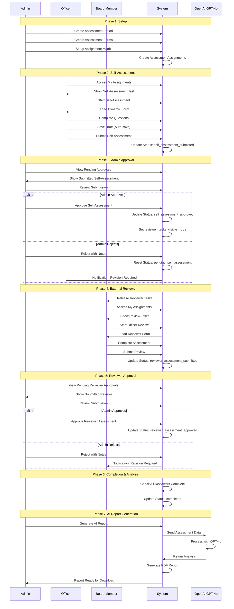
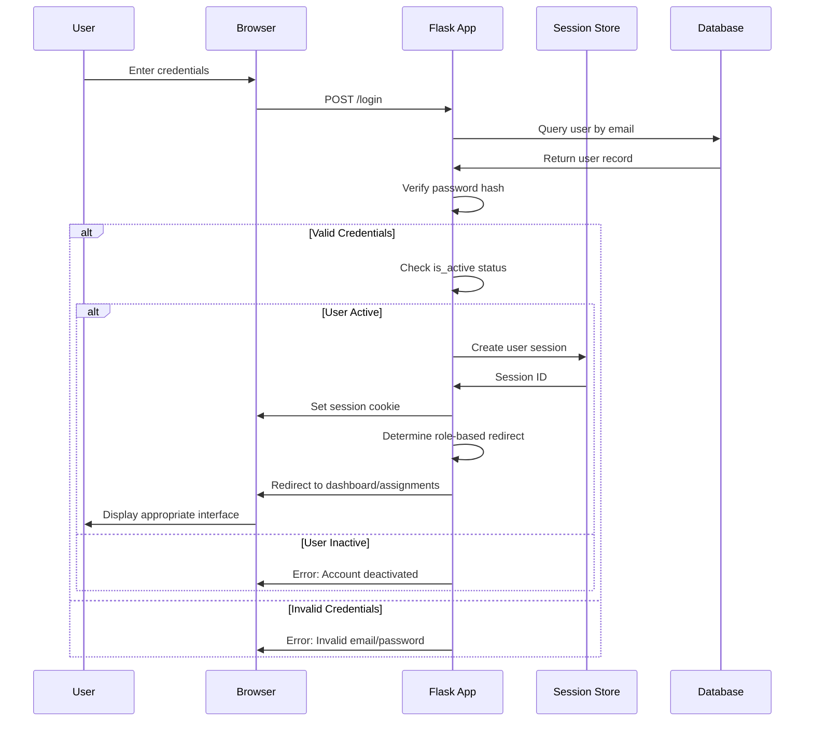
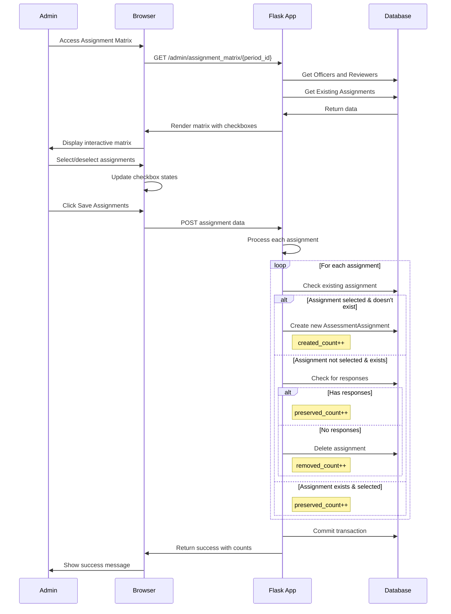
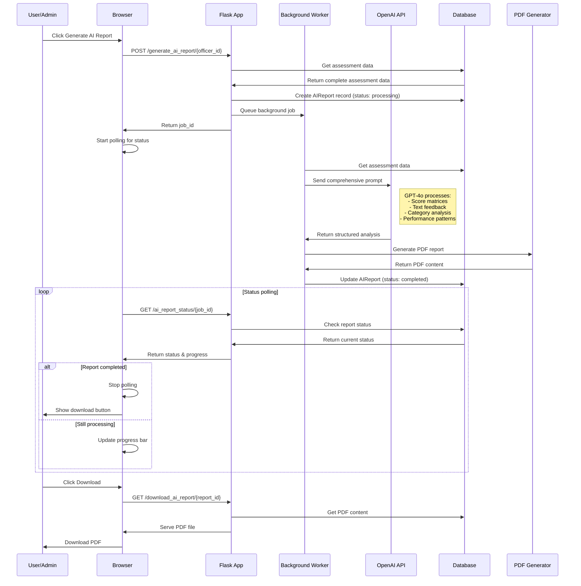
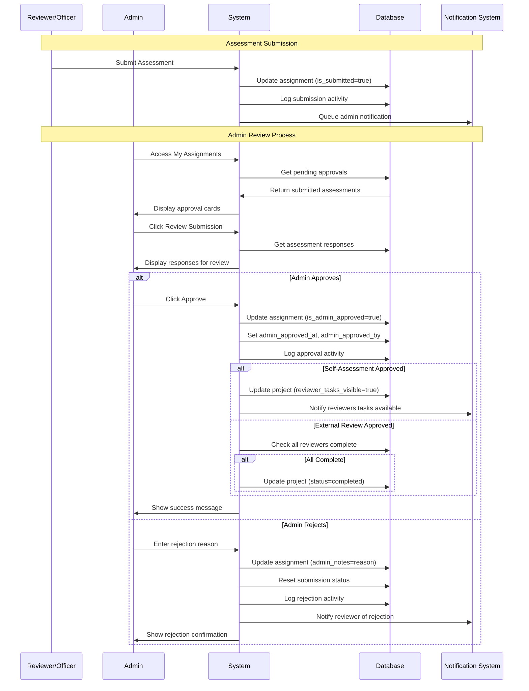

# AAAPerformanceTracker - Complete Developer Technical Guide
## Version 3.0 - Comprehensive System Documentation with UI Details

---

## Table of Contents
1. [System Architecture Overview](#system-architecture-overview)
2. [User Roles & Permissions Matrix](#user-roles--permissions-matrix)
3. [Navigation Bar & Menu Structure](#navigation-bar--menu-structure)
4. [Authentication System](#authentication-system)
5. [Dashboard System](#dashboard-system)
6. [Assessment Workflow](#assessment-workflow)
7. [Assessment Forms System](#assessment-forms-system)
8. [Assignment Matrix](#assignment-matrix)
9. [My Assignments Interface](#my-assignments-interface)
10. [Admin Management System](#admin-management-system)
11. [Reporting & AI System](#reporting--ai-system)
12. [Database Models & Relationships](#database-models--relationships)
13. [Frontend Components](#frontend-components)
14. [API Endpoints Reference](#api-endpoints-reference)
15. [Workflow Sequence Diagrams](#workflow-sequence-diagrams)

---

## System Architecture Overview

### High-Level Architecture
```
┌─────────────────┐    ┌─────────────────┐    ┌─────────────────┐
│   Frontend      │    │   Flask App     │    │   Database      │
│   (HTML/JS/CSS) │◄──►│   (Python)      │◄──►│   (PostgreSQL)  │
│                 │    │                 │    │                 │
│ • Bootstrap 5   │    │ • Routes        │    │ • 12 Tables     │
│ • FontAwesome   │    │ • Models        │    │ • Relationships │
│ • Custom CSS    │    │ • Forms         │    │ • Indexes       │
│ • JavaScript    │    │ • Utils         │    │ • Constraints   │
└─────────────────┘    └─────────────────┘    └─────────────────┘
                              │
                              ▼
                    ┌─────────────────┐
                    │   External      │
                    │   Services      │
                    │                 │
                    │ • OpenAI API    │
                    │ • Email Service │
                    │ • File Storage  │
                    └─────────────────┘
```

### Technology Stack Details
- **Backend**: Flask 3.1.1, SQLAlchemy 2.0.41, PostgreSQL 15+
- **Frontend**: Bootstrap 5, FontAwesome 6.0, Vanilla JavaScript
- **Authentication**: Flask-Login with session management
- **Forms**: WTForms with CSRF protection
- **AI Integration**: OpenAI GPT-4o API
- **Reports**: ReportLab PDF generation
- **Export**: openpyxl Excel generation

---

## User Roles & Permissions Matrix

### Role Definitions

#### Admin (`role='admin'`)
**Purpose**: System administrators with full access
**Capabilities**:
- ✅ Full system access and configuration
- ✅ User management (create, edit, delete, activate/deactivate)
- ✅ Assessment period/project management
- ✅ Assessment form creation and editing
- ✅ Assignment matrix management
- ✅ Approval workflows (self-assessments, reviewer assessments)
- ✅ AI report generation and management
- ✅ System monitoring and activity logs
- ✅ Data export/import functionality
- ✅ Admin chatbot access

#### Board Member (`role='board_member'`)
**Purpose**: Reviewers who evaluate officers
**Capabilities**:
- ✅ View assigned assessment tasks
- ✅ Complete assessment forms for assigned officers
- ✅ Submit assessments for admin approval
- ✅ View own assessment history
- ❌ Cannot access admin functions
- ❌ Cannot see other reviewers' assessments
- ❌ Cannot manage users or system settings

#### Officer (`role='officer'`)
**Purpose**: Employees being evaluated (reviewees)
**Capabilities**:
- ✅ Complete self-assessment forms
- ✅ View own assessment results (after admin approval)
- ✅ Access assessment matrix showing all reviewer ratings
- ✅ Download assessment reports
- ❌ Cannot access admin functions
- ❌ Cannot see assessment forms before completion
- ❌ Cannot review other officers

### Permission Logic Implementation
```python
# decorators in utils.py
@admin_required
def admin_only_function():
    # Only admin role can access
    
def role_based_redirect():
    if current_user.role == 'admin':
        return redirect('/dashboard')  # Admin dashboard
    elif current_user.role == 'board_member':
        return redirect('/my_assignments')  # Reviewer tasks
    elif current_user.role == 'officer':
        return redirect('/my_assignments')  # Self-assessments
```

---

## Navigation Bar & Menu Structure

### Main Navigation Bar (`base.html`)
**Location**: Top of every page
**Components**:

#### Left Side - Logo & Brand
- **Element**: `<a class="navbar-brand">`
- **Icon**: Custom logo image
- **Text**: "AAAPerformanceTracker"
- **Link**: Routes to dashboard based on user role
- **CSS Classes**: `.navbar-brand`, `.d-flex`, `.align-items-center`

#### Center - Main Navigation Links
**For All Authenticated Users**:
1. **Dashboard**
   - **Icon**: `<i class="fas fa-tachometer-alt">`
   - **Text**: "Dashboard"
   - **Route**: `/dashboard`
   - **Visibility**: All roles
   - **Active State**: `active` class when current page

2. **My Assignments**
   - **Icon**: `<i class="fas fa-tasks">`
   - **Text**: "My Assignments"
   - **Route**: `/my_assignments`
   - **Badge**: Shows count of pending tasks
   - **Badge Logic**: 
     ```html
     
     <span class="badge bg-primary ms-1">{{ assignment_count }}</span>
     
     ```

#### Right Side - User Menu
**User Dropdown**:
- **Trigger**: User name with dropdown arrow
- **Icon**: `<i class="fas fa-user-circle">`
- **CSS**: `.dropdown-toggle`

**Admin-Only Dropdown Items**:
1. **Admin Panel**
   - **Icon**: `<i class="fas fa-cog">`
   - **Route**: `/admin`
   - **Visibility**: ``

2. **Assessment Projects**
   - **Icon**: `<i class="fas fa-project-diagram">`
   - **Route**: `/admin/assessment_periods`

3. **Assessment Forms**
   - **Icon**: `<i class="fas fa-wpforms">`
   - **Route**: `/admin/assessment_forms`

4. **User Management**
   - **Icon**: `<i class="fas fa-users">`
   - **Route**: `/admin/users`

5. **Activity Logs**
   - **Icon**: `<i class="fas fa-history">`
   - **Route**: `/admin/activity_logs`

6. **Documentation & Help**
   - **Icon**: `<i class="fas fa-question-circle">`
   - **Route**: `/admin/documentation`

**All Users Dropdown Items**:
1. **Logout**
   - **Icon**: `<i class="fas fa-sign-out-alt">`
   - **Route**: `/logout`
   - **Method**: POST

### Navigation State Management
```javascript
// main.js - Navigation active state
document.addEventListener('DOMContentLoaded', function() {
    // Highlight current page in navigation
    const currentPath = window.location.pathname;
    const navLinks = document.querySelectorAll('.navbar-nav .nav-link');
    
    navLinks.forEach(link => {
        if (link.getAttribute('href') === currentPath) {
            link.classList.add('active');
        }
    });
});
```

---

## Authentication System

### Login Page (`/login`)
**Template**: `login.html`
**Route**: `@app.route('/login', methods=['GET', 'POST'])`

#### UI Elements
1. **Page Title**: "Login to AAAPerformanceTracker"
2. **Form Container**:
   - **CSS**: `.card`, `.card-body`, `.mx-auto` (max-width: 400px)
   - **Background**: White card with subtle shadow

3. **Email Field**:
   - **Label**: "Email Address"
   - **Input**: `<input type="email" name="email" class="form-control">`
   - **Icon**: `<i class="fas fa-envelope"></i>` (prepended)
   - **Validation**: Required, email format
   - **Placeholder**: "Enter your email"

4. **Password Field**:
   - **Label**: "Password"
   - **Input**: `<input type="password" name="password" class="form-control">`
   - **Icon**: `<i class="fas fa-lock"></i>` (prepended)
   - **Validation**: Required, minimum 8 characters
   - **Placeholder**: "Enter your password"

5. **Remember Me**:
   - **Checkbox**: `<input type="checkbox" name="remember_me">`
   - **Label**: "Remember me for 30 days"

6. **Login Button**:
   - **Button**: `<button type="submit" class="btn btn-primary btn-block">`
   - **Text**: "Sign In"
   - **Icon**: `<i class="fas fa-sign-in-alt"></i>`
   - **Loading State**: Shows spinner during submission

#### Authentication Flow
```python
@app.route('/login', methods=['GET', 'POST'])
def login():
    form = LoginForm()
    if form.validate_on_submit():
        user = User.query.filter_by(email=form.email.data).first()
        if user and user.check_password(form.password.data):
            if not user.is_active:
                flash('Account is deactivated. Contact administrator.')
                return redirect(url_for('login'))
            
            login_user(user, remember=form.remember_me.data)
            
            # Role-based redirect
            if user.role == 'admin':
                return redirect(url_for('dashboard'))
            elif user.role == 'board_member':
                return redirect(url_for('my_assignments'))
            else:  # officer
                return redirect(url_for('my_assignments'))
        else:
            flash('Invalid email or password')
    
    return render_template('login.html', form=form)
```

#### Error Handling
- **Invalid Credentials**: Red alert message "Invalid email or password"
- **Inactive Account**: Warning message "Account is deactivated"
- **Validation Errors**: Field-level error messages below inputs
- **Rate Limiting**: 5 attempts per 15 minutes per IP

---

## Dashboard System

### Admin Dashboard (`/dashboard`)
**Route**: `@app.route('/dashboard')`
**Template**: `dashboard.html`
**Access**: Admin only (`@admin_required`)

#### Page Structure
1. **Page Header**:
   - **Title**: "Administrative Dashboard"
   - **Breadcrumb**: Home > Dashboard
   - **Last Updated**: Shows current timestamp

2. **Statistics Cards Row** (4 cards):
   
   **Card 1 - Total Users**:
   - **Icon**: `<i class="fas fa-users text-primary"></i>`
   - **Value**: `{{ total_users }}` (dynamic count)
   - **Label**: "Total Users"
   - **Color**: Blue (`bg-primary`)
   - **Link**: Routes to `/admin/users`

   **Card 2 - Active Projects**:
   - **Icon**: `<i class="fas fa-project-diagram text-success"></i>`
   - **Value**: `{{ active_periods }}` 
   - **Label**: "Active Assessment Projects"
   - **Color**: Green (`bg-success`)
   - **Link**: Routes to `/admin/assessment_periods`

   **Card 3 - Assessment Forms**:
   - **Icon**: `<i class="fas fa-wpforms text-warning"></i>`
   - **Value**: `{{ total_forms }}`
   - **Label**: "Assessment Forms"
   - **Color**: Orange (`bg-warning`)
   - **Link**: Routes to `/admin/assessment_forms`

   **Card 4 - Completion Rate**:
   - **Icon**: `<i class="fas fa-chart-line text-info"></i>`
   - **Value**: `{{ completion_rate }}%`
   - **Label**: "Overall Completion Rate"
   - **Color**: Cyan (`bg-info`)
   - **Progress Bar**: Visual completion indicator

3. **Quick Actions Row**:
   
   **Create New Project Button**:
   - **Button**: `<a href="/admin/create_assessment_period" class="btn btn-success">`
   - **Icon**: `<i class="fas fa-plus"></i>`
   - **Text**: "Create Assessment Project"

   **Manage Users Button**:
   - **Button**: `<a href="/admin/users" class="btn btn-primary">`
   - **Icon**: `<i class="fas fa-user-cog"></i>`
   - **Text**: "Manage Users"

   **View Reports Button**:
   - **Button**: `<a href="/admin/reports" class="btn btn-info">`
   - **Icon**: `<i class="fas fa-chart-bar"></i>`
   - **Text**: "View Reports"

4. **Charts Section**:
   
   **Monthly Activity Chart**:
   - **Container**: `<canvas id="monthlyActivityChart">`
   - **Library**: Chart.js
   - **Type**: Line chart
   - **Data**: Assessment submissions by month
   - **Colors**: Blue theme

   **Role Distribution Chart**:
   - **Container**: `<canvas id="roleDistributionChart">`
   - **Type**: Doughnut chart
   - **Data**: User counts by role
   - **Colors**: Multi-color palette

5. **Recent Activity Table**:
   - **Headers**: User, Action, Time, Status
   - **Data Source**: `activity_log` table (last 10 entries)
   - **Pagination**: Shows "View All" link
   - **Row Actions**: View details icon

#### Dashboard Data Logic
```python
@app.route('/dashboard')
@admin_required
def dashboard():
    # Statistics
    total_users = User.query.count()
    active_periods = AssessmentPeriod.query.filter_by(is_active=True).count()
    total_forms = AssessmentForm.query.count()
    
    # Completion rate calculation
    total_assignments = AssessmentAssignment.query.count()
    completed_assignments = AssessmentAssignment.query.filter_by(is_completed=True).count()
    completion_rate = round((completed_assignments / total_assignments * 100) if total_assignments > 0 else 0, 1)
    
    # Recent activity
    recent_activity = ActivityLog.query.order_by(ActivityLog.timestamp.desc()).limit(10).all()
    
    # Chart data
    monthly_data = get_monthly_activity_data()  # Custom function
    role_data = get_role_distribution_data()    # Custom function
    
    return render_template('dashboard.html',
                         total_users=total_users,
                         active_periods=active_periods,
                         total_forms=total_forms,
                         completion_rate=completion_rate,
                         recent_activity=recent_activity,
                         monthly_data=monthly_data,
                         role_data=role_data)
```

### Board Member/Officer Dashboard
**Route**: Redirects to `/my_assignments`
**Reason**: Non-admin users don't have dashboard access, they go directly to their task list

---

## Assessment Workflow

### Workflow States & Transitions

#### Assessment Project Lifecycle


#### Assessment Status Values
**Database Field**: `assessment_project.status`

1. **`pending_self_assessment`**:
   - **Meaning**: Officer needs to complete self-assessment
   - **UI Display**: "Pending Self-Assessment" (orange badge)
   - **Officer Action**: Can access self-assessment form
   - **Reviewer Action**: Cannot see reviewer tasks

2. **`self_assessment_submitted`**:
   - **Meaning**: Officer submitted, waiting for admin approval
   - **UI Display**: "Pending Admin Approval" (yellow badge)
   - **Admin Action**: Can approve/reject self-assessment

3. **`self_assessment_approved`**:
   - **Meaning**: Admin approved, reviewer tasks visible
   - **UI Display**: "Reviewer Tasks Active" (blue badge)
   - **Property**: `reviewer_tasks_visible = True`

4. **`reviewers_assigned`**:
   - **Meaning**: Reviewers have been notified
   - **UI Display**: "In Progress" (blue badge)

5. **`completed`**:
   - **Meaning**: All assessments done and approved
   - **UI Display**: "Completed" (green badge)

### Workflow Implementation

#### Self-Assessment Submission
```python
@app.route('/assessment/<int:assignment_id>/submit', methods=['POST'])
@login_required
def submit_assessment(assignment_id):
    assignment = AssessmentAssignment.query.get_or_404(assignment_id)
    
    # Validate user can submit this assessment
    if assignment.reviewer_id != current_user.id:
        abort(403)
    
    # Process form responses
    responses = process_assessment_responses(request.form, assignment)
    
    # Update assignment status
    assignment.is_submitted = True
    assignment.submitted_at = datetime.utcnow()
    
    # If self-assessment, update project status
    if assignment.officer_id == assignment.reviewer_id:
        project = AssessmentProject.query.filter_by(
            period_id=assignment.period_id,
            officer_id=assignment.officer_id
        ).first()
        project.status = 'self_assessment_submitted'
        project.self_assessment_submitted_at = datetime.utcnow()
    
    # Log activity
    log_assessment_activity(
        'self_assessment_submitted' if assignment.is_self_assessment else 'reviewer_assessment_submitted',
        assignment=assignment,
        actor_id=current_user.id
    )
    
    db.session.commit()
    flash('Assessment submitted successfully!')
    return redirect(url_for('my_assignments'))
```

#### Admin Approval Process
```python
@app.route('/admin/approve_self_assessment/<int:assignment_id>', methods=['POST'])
@admin_required
def approve_self_assessment(assignment_id):
    assignment = AssessmentAssignment.query.get_or_404(assignment_id)
    
    # Update assignment approval
    assignment.is_admin_approved = True
    assignment.admin_approved_at = datetime.utcnow()
    assignment.admin_approved_by = current_user.id
    
    # Update project status to release reviewer tasks
    project = AssessmentProject.query.filter_by(
        period_id=assignment.period_id,
        officer_id=assignment.officer_id
    ).first()
    project.status = 'self_assessment_approved'
    project.reviewer_tasks_visible = True
    project.reviewers_released_at = datetime.utcnow()
    
    # Log activity
    log_assessment_activity(
        'admin_approved_self_assessment',
        assignment=assignment,
        actor_id=current_user.id
    )
    
    db.session.commit()
    flash('Self-assessment approved. Reviewer tasks are now visible.')
    return redirect(url_for('my_assignments'))
```

---

## Assessment Forms System

### Form Builder Interface (`/admin/assessment_forms`)
**Route**: `@app.route('/admin/assessment_forms')`
**Template**: `admin/assessment_forms.html`
**Access**: Admin only

#### Page Layout
1. **Page Header**:
   - **Title**: "Assessment Forms Management"
   - **Breadcrumb**: Admin > Assessment Forms
   - **Create Button**: "Create New Form" (green, top-right)

2. **Forms Table**:
   - **Table Classes**: `.table`, `.table-striped`, `.table-hover`
   - **Responsive**: `.table-responsive` wrapper

   **Table Headers**:
   - Form Title (sortable)
   - Description (truncated)
   - Questions Count
   - Status (Active/Inactive badge)
   - Created By
   - Actions

   **Status Badge Logic**:
   ```html
   
       <span class="badge bg-success">Active</span>
   
       <span class="badge bg-secondary">Inactive</span>
   
   ```

3. **Action Buttons** (per form row):
   
   **Edit Button**:
   - **Icon**: `<i class="fas fa-edit"></i>`
   - **Class**: `btn btn-sm btn-primary`
   - **Route**: `/admin/assessment_forms/{{ form.id }}/edit`
   - **Tooltip**: "Edit form title and description"

   **Questions Button**:
   - **Icon**: `<i class="fas fa-list"></i>`
   - **Class**: `btn btn-sm btn-info`
   - **Route**: `/admin/assessment_forms/{{ form.id }}/questions`
   - **Tooltip**: "Manage questions ({{ form.questions|length }})"

   **Preview Button**:
   - **Icon**: `<i class="fas fa-eye"></i>`
   - **Class**: `btn btn-sm btn-secondary`
   - **Route**: `/admin/assessment_forms/{{ form.id }}/preview`
   - **Tooltip**: "Preview form"

   **Toggle Status Button**:
   - **Icon**: `<i class="fas fa-toggle-on"></i>` or `<i class="fas fa-toggle-off"></i>`
   - **Class**: `btn btn-sm btn-warning`
   - **Action**: JavaScript toggle function
   - **Tooltip**: "Activate/Deactivate form"

   **Delete Button**:
   - **Icon**: `<i class="fas fa-trash"></i>`
   - **Class**: `btn btn-sm btn-danger`
   - **Action**: Confirmation modal
   - **Tooltip**: "Delete form"

### Question Management (`/admin/assessment_forms/{form_id}/questions`)

#### Question Types Supported
1. **Text Input** (`question_type='text'`):
   - **HTML**: `<input type="text" class="form-control">`
   - **Settings**: `max_chars` (default: 500)
   - **Use Case**: Short text responses, names, titles

2. **Textarea** (`question_type='textarea'`):
   - **HTML**: `<textarea class="form-control" rows="4">`
   - **Settings**: `max_chars` (default: 2000)
   - **Use Case**: Long text responses, feedback, comments

3. **Rating Scale** (`question_type='rating'`):
   - **HTML**: Radio buttons with numeric values
   - **Settings**: 
     ```json
     {
         "min_rating": 1,
         "max_rating": 5,
         "labels": ["Poor", "Below Average", "Average", "Good", "Excellent"]
     }
     ```
   - **Rendering**: Horizontal radio buttons with labels

4. **Multiple Choice** (`question_type='multiple_choice'`):
   - **HTML**: Radio buttons with custom options
   - **Settings**: 
     ```json
     {
         "options": ["Option 1", "Option 2", "Option 3"]
     }
     ```

5. **Checkbox** (`question_type='checkbox'`):
   - **HTML**: `<input type="checkbox">`
   - **Settings**: Custom label text
   - **Use Case**: Agreements, confirmations

6. **Date** (`question_type='date'`):
   - **HTML**: `<input type="date" class="form-control">`
   - **Use Case**: Assessment dates, deadlines

#### Question Creation Form
**Modal Dialog**: Bootstrap modal (`#addQuestionModal`)

**Form Fields**:
1. **Question Name**:
   - **Field**: `<input name="question_name" class="form-control">`
   - **Purpose**: Internal identifier
   - **Validation**: Required, max 100 chars

2. **Question Text**:
   - **Field**: `<textarea name="question_text" class="form-control">`
   - **Purpose**: Display text for users
   - **Validation**: Required, max 1000 chars

3. **Question Type**:
   - **Field**: `<select name="question_type" class="form-select">`
   - **Options**: text, textarea, rating, multiple_choice, checkbox, date
   - **Change Handler**: Shows/hides type-specific settings

4. **Required Toggle**:
   - **Field**: `<input type="checkbox" name="is_required">`
   - **Default**: Checked
   - **Purpose**: Validation enforcement

5. **Type-Specific Settings**:
   - **Rating Settings**: Min/max values, label array
   - **Text Settings**: Character limits
   - **Multiple Choice**: Option list (dynamic add/remove)

#### Question Order Management
**Drag & Drop Interface**:
- **Library**: Sortable.js
- **Handle**: `<i class="fas fa-grip-vertical"></i>` (drag handle)
- **Update Route**: `/admin/assessment_forms/{form_id}/questions/reorder`
- **Method**: AJAX POST with new order array

```javascript
// Question reordering
new Sortable(document.getElementById('questionsList'), {
    handle: '.drag-handle',
    animation: 150,
    onEnd: function(evt) {
        const questionIds = Array.from(evt.to.children).map(item => 
            item.dataset.questionId
        );
        
        fetch(`/admin/assessment_forms/${formId}/questions/reorder`, {
            method: 'POST',
            headers: {
                'Content-Type': 'application/json',
                'X-CSRFToken': csrfToken
            },
            body: JSON.stringify({question_orders: questionIds})
        });
    }
});
```

---


## Assignment Matrix System

### Assignment Matrix Interface (`/admin/assignment_matrix/{period_id}`)
**Route**: `@app.route('/admin/assignment_matrix/<int:period_id>')`
**Template**: `admin/assignment_matrix.html`
**Purpose**: Visual matrix for creating reviewer-officer assignments

#### Matrix Layout Structure
```
       │ Reviewer 1 │ Reviewer 2 │ Reviewer 3 │ Self │
───────┼────────────┼────────────┼────────────┼──────┤
Officer│     ☐      │     ☐      │     ☑      │  ☑   │
   A   │            │            │            │      │
───────┼────────────┼────────────┼────────────┼──────┤
Officer│     ☑      │     ☐      │     ☐      │  ☑   │
   B   │            │            │            │      │
───────┼────────────┼────────────┼────────────┼──────┤
```

#### UI Components

**1. Matrix Container**:
- **Element**: `<div class="assignment-matrix-container">`
- **CSS**: Responsive table with sticky headers
- **JavaScript**: Real-time checkbox management

**2. Matrix Headers**:
- **Row Header**: Officer names (left column)
  - **Format**: "FirstName LastName"
  - **Role Badge**: "Officer" badge in blue
  - **CSS**: `.matrix-row-header`

- **Column Headers**: Reviewer names (top row)
  - **Format**: "FirstName L." (shortened last name)
  - **Role Badge**: "Board Member" or "Self" badges
  - **CSS**: `.matrix-col-header`
  - **Self Column**: Special styling with diagonal pattern

**3. Matrix Checkboxes**:
- **Element**: `<input type="checkbox" class="assignment-checkbox">`
- **Data Attributes**:
  ```html
  data-officer-id="{{ officer.id }}"
  data-reviewer-id="{{ reviewer.id }}"
  data-assignment-id="{{ assignment.id if assignment else '' }}"
  ```
- **States**:
  - **Unchecked**: No assignment
  - **Checked**: Assignment exists
  - **Disabled**: Assignment with existing responses (cannot delete)
  - **Pre-checked**: Self-assessment cells (auto-selected)

**4. Control Buttons**:

**Select All Self Button**:
- **Button**: `<button class="btn btn-primary btn-sm" id="selectAllSelf">`
- **Icon**: `<i class="fas fa-user-check"></i>`
- **Action**: Checks all diagonal (self-assessment) checkboxes
- **JavaScript**:
  ```javascript
  document.getElementById('selectAllSelf').addEventListener('click', function() {
      document.querySelectorAll('.self-assignment-checkbox').forEach(cb => {
          cb.checked = true;
      });
      updateSelectionCount();
  });
  ```

**Select All Button**:
- **Button**: `<button class="btn btn-success btn-sm" id="selectAll">`
- **Icon**: `<i class="fas fa-check-all"></i>`
- **Action**: Checks all available checkboxes

**Clear All Button**:
- **Button**: `<button class="btn btn-warning btn-sm" id="clearAll">`
- **Icon**: `<i class="fas fa-times"></i>`
- **Action**: Unchecks all non-disabled checkboxes

**Save Assignments Button**:
- **Button**: `<button class="btn btn-success" id="saveAssignments">`
- **Icon**: `<i class="fas fa-save"></i>`
- **Text**: "Save Assignment Matrix"
- **Action**: Submits form with checkbox states

#### Matrix JavaScript Logic
```javascript
class AssignmentMatrix {
    constructor(periodId) {
        this.periodId = periodId;
        this.init();
    }
    
    init() {
        this.bindEvents();
        this.updateSelectionCount();
        this.highlightExistingAssignments();
    }
    
    bindEvents() {
        // Checkbox change handler
        document.querySelectorAll('.assignment-checkbox').forEach(cb => {
            cb.addEventListener('change', this.handleCheckboxChange.bind(this));
        });
        
        // Save button handler
        document.getElementById('saveAssignments').addEventListener('click', 
            this.saveAssignments.bind(this));
    }
    
    handleCheckboxChange(event) {
        const checkbox = event.target;
        const officerId = checkbox.dataset.officerId;
        const reviewerId = checkbox.dataset.reviewerId;
        
        // Visual feedback
        this.updateCellVisual(checkbox);
        this.updateSelectionCount();
        
        // Validation
        if (officerId === reviewerId && !checkbox.checked) {
            // Prevent unchecking self-assessments
            checkbox.checked = true;
            this.showMessage('Self-assessments cannot be removed', 'warning');
        }
    }
    
    updateCellVisual(checkbox) {
        const cell = checkbox.closest('td');
        if (checkbox.checked) {
            cell.classList.add('selected');
            cell.innerHTML += '<i class="fas fa-check text-success"></i>';
        } else {
            cell.classList.remove('selected');
            cell.querySelector('.fa-check')?.remove();
        }
    }
    
    async saveAssignments() {
        const assignments = this.collectAssignments();
        
        try {
            const response = await fetch(`/admin/create_assignments/${this.periodId}`, {
                method: 'POST',
                headers: {
                    'Content-Type': 'application/json',
                    'X-CSRFToken': this.getCsrfToken()
                },
                body: JSON.stringify({assignments: assignments})
            });
            
            const result = await response.json();
            
            if (result.success) {
                this.showMessage(
                    `Created: ${result.created}, Preserved: ${result.preserved}, Removed: ${result.removed}`,
                    'success'
                );
                this.refreshMatrix();
            } else {
                this.showMessage(result.message, 'error');
            }
        } catch (error) {
            this.showMessage('Failed to save assignments', 'error');
        }
    }
    
    collectAssignments() {
        const assignments = [];
        document.querySelectorAll('.assignment-checkbox').forEach(cb => {
            assignments.push({
                officer_id: parseInt(cb.dataset.officerId),
                reviewer_id: parseInt(cb.dataset.reviewerId),
                selected: cb.checked
            });
        });
        return assignments;
    }
}

// Initialize on page load
document.addEventListener('DOMContentLoaded', function() {
    const periodId = document.querySelector('[data-period-id]').dataset.periodId;
    new AssignmentMatrix(periodId);
});
```

#### Assignment Creation Backend Logic
```python
@app.route('/admin/create_assignments/<int:period_id>', methods=['POST'])
@admin_required
def create_assignments(period_id):
    data = request.get_json()
    assignments = data.get('assignments', [])
    
    created_count = 0
    preserved_count = 0
    removed_count = 0
    
    for assignment_data in assignments:
        officer_id = assignment_data['officer_id']
        reviewer_id = assignment_data['reviewer_id']
        selected = assignment_data['selected']
        
        # Check if assignment exists
        existing = AssessmentAssignment.query.filter_by(
            period_id=period_id,
            officer_id=officer_id,
            reviewer_id=reviewer_id
        ).first()
        
        if selected and not existing:
            # Create new assignment
            new_assignment = AssessmentAssignment(
                period_id=period_id,
                officer_id=officer_id,
                reviewer_id=reviewer_id,
                is_completed=False,
                is_submitted=False,
                is_admin_approved=False
            )
            db.session.add(new_assignment)
            created_count += 1
            
            # Log activity
            log_assessment_activity(
                'assignment_created',
                officer_id=officer_id,
                reviewer_id=reviewer_id,
                period_id=period_id,
                actor_id=current_user.id
            )
            
        elif not selected and existing:
            # Check if assignment has responses
            has_responses = AssessmentResponse.query.filter_by(
                assessment_assignment_id=existing.id
            ).first()
            
            if has_responses:
                # Cannot delete - preserve
                preserved_count += 1
            else:
                # Safe to delete
                db.session.delete(existing)
                removed_count += 1
                
        elif existing:
            # Assignment exists and should exist - preserve
            preserved_count += 1
    
    try:
        db.session.commit()
        return jsonify({
            'success': True,
            'message': f'Matrix updated successfully',
            'created': created_count,
            'preserved': preserved_count,
            'removed': removed_count
        })
    except Exception as e:
        db.session.rollback()
        return jsonify({
            'success': False,
            'message': f'Failed to update assignments: {str(e)}'
        })
```

---

## My Assignments Interface

### My Assignments Page (`/my_assignments`)
**Route**: `@app.route('/my_assignments')`
**Template**: `my_assignments.html`
**Access**: All authenticated users
**Purpose**: Shows user's pending and completed assessment tasks

#### Role-Based Content Logic
```python
@app.route('/my_assignments')
@login_required
def my_assignments():
    assignments = []
    pending_approvals = []
    
    if current_user.role == 'admin':
        # Admin sees pending approvals and can approve/reject
        pending_approvals = get_pending_admin_approvals()
        
    elif current_user.role in ['board_member', 'officer']:
        # Get user's assignments
        assignments = AssessmentAssignment.query.filter_by(
            reviewer_id=current_user.id
        ).join(AssessmentProject).filter(
            # Show assignments where self-assessment is approved OR it's a self-assessment
            or_(
                AssessmentProject.reviewer_tasks_visible == True,
                AssessmentAssignment.officer_id == current_user.id
            )
        ).all()
    
    return render_template('my_assignments.html',
                         assignments=assignments,
                         pending_approvals=pending_approvals)
```

#### Page Layout Structure

**1. Page Header**:
- **Title**: "My Assessment Tasks"
- **Subtitle**: Shows count - "You have X pending assignments"
- **Last Updated**: Current timestamp

**2. Tabs Navigation** (Bootstrap tabs):
```html
<ul class="nav nav-tabs" role="tablist">
    <li class="nav-item">
        <a class="nav-link active" data-bs-toggle="tab" href="#pending-assignments">
            <i class="fas fa-clock"></i> Pending Tasks
            <span class="badge bg-primary ms-1">{{ pending_count }}</span>
        </a>
    </li>
    <li class="nav-item">
        <a class="nav-link" data-bs-toggle="tab" href="#completed-assignments">
            <i class="fas fa-check-circle"></i> Completed
            <span class="badge bg-success ms-1">{{ completed_count }}</span>
        </a>
    </li>
    
    <li class="nav-item">
        <a class="nav-link" data-bs-toggle="tab" href="#pending-approvals">
            <i class="fas fa-user-check"></i> Pending Approvals
            <span class="badge bg-warning ms-1">{{ approval_count }}</span>
        </a>
    </li>
    
</ul>
```

**3. Assignment Cards** (per assignment):

**Card Structure**:
```html
<div class="card assignment-card mb-3">
    <div class="card-header d-flex justify-content-between">
        <div>
            <h6 class="card-title">
                
                    <i class="fas fa-user-circle text-primary"></i> 
                    Self-Assessment
                
                    <i class="fas fa-user-friends text-info"></i>
                    Reviewing {{ assignment.officer.name }}
                
            </h6>
            <small class="text-muted">{{ assignment.period.name }}</small>
        </div>
        <div>
            
                <span class="badge bg-success">✓ Completed</span>
            
                <span class="badge bg-warning">⏳ Pending Admin</span>
            
                <span class="badge bg-primary">● In Progress</span>
            
        </div>
    </div>
    
    <div class="card-body">
        <div class="row">
            <div class="col-md-8">
                <p><strong>Assessing:</strong> {{ assignment.officer.name }}</p>
                <p><strong>Due Date:</strong> {{ assignment.period.due_date.strftime('%B %d, %Y') }}</p>
                <p><strong>Form:</strong> {{ get_assignment_form_title(assignment) }}</p>
                
                
                <p><strong>Submitted:</strong> {{ assignment.submitted_at.strftime('%B %d, %Y at %I:%M %p') }}</p>
                
                
                
                <div class="alert alert-info">
                    <strong>Admin Notes:</strong> {{ assignment.admin_notes }}
                </div>
                
            </div>
            
            <div class="col-md-4 text-end">
                
                    
                        <p class="text-muted">Waiting for admin approval</p>
                    
                        <a href="/assessment/{{ assignment.id }}/start" class="btn btn-primary">
                            <i class="fas fa-play"></i> 
                            
                                Continue
                            
                                Start Assessment
                            
                        </a>
                    
                
                    <a href="/assessment/{{ assignment.id }}/view" class="btn btn-success">
                        <i class="fas fa-eye"></i> View Completed
                    </a>
                
            </div>
        </div>
    </div>
    
    
    <div class="card-footer text-muted">
        Completed on {{ assignment.completed_at.strftime('%B %d, %Y') }}
        by {{ assignment.officer.name }}
    </div>
    
</div>
```

**4. Admin Approval Cards** (Admin only):
```html
<div class="card approval-card mb-3 border-warning">
    <div class="card-header bg-warning text-dark">
        <h6><i class="fas fa-clock"></i> Pending Approval Required</h6>
    </div>
    
    <div class="card-body">
        <div class="row">
            <div class="col-md-8">
                <p><strong>{{ assignment.officer.name }}</strong> submitted their assessment</p>
                <p><strong>Submitted:</strong> {{ assignment.submitted_at.strftime('%B %d, %Y at %I:%M %p') }}</p>
                <p><strong>Assessment Type:</strong> 
                    
                        Self-Assessment
                    
                        External Review
                    
                </p>
            </div>
            
            <div class="col-md-4 text-end">
                <div class="btn-group-vertical">
                    <a href="/assessment/{{ assignment.id }}/review" class="btn btn-info btn-sm">
                        <i class="fas fa-eye"></i> Review Submission
                    </a>
                    
                    <button class="btn btn-success btn-sm approve-btn" 
                            data-assignment-id="{{ assignment.id }}">
                        <i class="fas fa-check"></i> Approve
                    </button>
                    
                    <button class="btn btn-danger btn-sm reject-btn" 
                            data-assignment-id="{{ assignment.id }}">
                        <i class="fas fa-times"></i> Request Changes
                    </button>
                </div>
            </div>
        </div>
    </div>
</div>
```

#### Assignment Status Logic
**Status Determination Function**:
```python
def get_assignment_status(assignment):
    """Determine display status for assignment"""
    
    if assignment.is_completed and assignment.is_admin_approved:
        return {
            'status': 'completed',
            'badge_class': 'bg-success',
            'icon': 'fas fa-check-circle',
            'text': '✓ Completed',
            'action': 'view'
        }
    
    elif assignment.is_submitted and not assignment.is_admin_approved:
        return {
            'status': 'pending_approval',
            'badge_class': 'bg-warning',
            'icon': 'fas fa-clock',
            'text': '⏳ Pending Admin Approval',
            'action': 'wait'
        }
    
    elif has_draft_responses(assignment):
        return {
            'status': 'in_progress',
            'badge_class': 'bg-info',
            'icon': 'fas fa-edit',
            'text': '● In Progress',
            'action': 'continue'
        }
    
    else:
        return {
            'status': 'not_started',
            'badge_class': 'bg-primary',
            'icon': 'fas fa-play',
            'text': '▶ Ready to Start',
            'action': 'start'
        }
```

#### JavaScript Functionality
```javascript
// My Assignments page functionality
class MyAssignments {
    constructor() {
        this.init();
    }
    
    init() {
        this.bindApprovalButtons();
        this.bindTabEvents();
        this.updateCounts();
    }
    
    bindApprovalButtons() {
        // Approve button handler
        document.querySelectorAll('.approve-btn').forEach(btn => {
            btn.addEventListener('click', this.approveAssignment.bind(this));
        });
        
        // Reject button handler  
        document.querySelectorAll('.reject-btn').forEach(btn => {
            btn.addEventListener('click', this.rejectAssignment.bind(this));
        });
    }
    
    async approveAssignment(event) {
        const assignmentId = event.target.dataset.assignmentId;
        
        if (!confirm('Approve this assessment submission?')) return;
        
        try {
            const response = await fetch(`/admin/approve_assessment/${assignmentId}`, {
                method: 'POST',
                headers: {
                    'X-CSRFToken': this.getCsrfToken()
                }
            });
            
            const result = await response.json();
            
            if (result.success) {
                this.showMessage('Assessment approved successfully', 'success');
                this.removeApprovalCard(assignmentId);
                this.updateCounts();
            } else {
                this.showMessage(result.message, 'error');
            }
        } catch (error) {
            this.showMessage('Failed to approve assessment', 'error');
        }
    }
    
    async rejectAssignment(event) {
        const assignmentId = event.target.dataset.assignmentId;
        
        const reason = prompt('Reason for requesting changes:');
        if (!reason) return;
        
        try {
            const response = await fetch(`/admin/reject_assessment/${assignmentId}`, {
                method: 'POST',
                headers: {
                    'Content-Type': 'application/json',
                    'X-CSRFToken': this.getCsrfToken()
                },
                body: JSON.stringify({reason: reason})
            });
            
            const result = await response.json();
            
            if (result.success) {
                this.showMessage('Assessment returned for revision', 'info');
                this.removeApprovalCard(assignmentId);
                this.updateCounts();
            } else {
                this.showMessage(result.message, 'error');
            }
        } catch (error) {
            this.showMessage('Failed to reject assessment', 'error');
        }
    }
    
    removeApprovalCard(assignmentId) {
        const card = document.querySelector(`[data-assignment-id="${assignmentId}"]`).closest('.approval-card');
        card.style.opacity = '0.5';
        setTimeout(() => card.remove(), 300);
    }
    
    updateCounts() {
        // Update tab badges with current counts
        const pendingCount = document.querySelectorAll('.assignment-card:not(.completed)').length;
        const completedCount = document.querySelectorAll('.assignment-card.completed').length;
        const approvalCount = document.querySelectorAll('.approval-card').length;
        
        document.querySelector('#pending-assignments .badge').textContent = pendingCount;
        document.querySelector('#completed-assignments .badge').textContent = completedCount;
        
        if (document.querySelector('#pending-approvals .badge')) {
            document.querySelector('#pending-approvals .badge').textContent = approvalCount;
        }
    }
}

// Initialize on page load
document.addEventListener('DOMContentLoaded', () => new MyAssignments());
```


## Assessment Execution Interface

### Assessment Form Interface (`/assessment/{assignment_id}/start`)
**Route**: `@app.route('/assessment/<int:assignment_id>/start')`
**Template**: `assessment/assessment_form.html`
**Purpose**: Dynamic form rendering based on assessment type

#### Form Header Section
**Officer Information Panel**:
```html
<div class="assessment-header bg-light p-3 mb-4 rounded">
    <div class="row">
        <div class="col-md-6">
            <h4><i class="fas fa-user-circle"></i> {{ assignment.officer.name }}</h4>
            <p class="mb-1"><strong>Position:</strong> {{ assignment.officer.role|title }}</p>
            <p class="mb-1"><strong>Assessment Period:</strong> {{ assignment.period.name }}</p>
            <p class="mb-0"><strong>Due Date:</strong> 
                <span class="badge bg-warning">{{ assignment.period.due_date.strftime('%B %d, %Y') }}</span>
            </p>
        </div>
        
        <div class="col-md-6 text-end">
            
                <div class="alert alert-info mb-0">
                    <i class="fas fa-user-check"></i> 
                    <strong>Self-Assessment</strong>
                    <br><small>You are evaluating yourself</small>
                </div>
            
                <div class="alert alert-primary mb-0">
                    <i class="fas fa-user-friends"></i> 
                    <strong>External Review</strong>
                    <br><small>You are evaluating {{ assignment.officer.name }}</small>
                </div>
            
        </div>
    </div>
</div>
```

#### Progress Indicator
**Progress Bar Component**:
```html
<div class="progress-container mb-4">
    <div class="d-flex justify-content-between align-items-center mb-2">
        <span><strong>Progress:</strong></span>
        <span id="progress-text">0 of {{ total_questions }} questions answered</span>
    </div>
    
    <div class="progress" style="height: 8px;">
        <div class="progress-bar bg-success" 
             role="progressbar" 
             id="progress-bar"
             style="width: 0%"
             aria-valuenow="0" 
             aria-valuemin="0" 
             aria-valuemax="100">
        </div>
    </div>
    
    <div class="mt-2 text-end">
        <small class="text-muted" id="completion-status">
            Required questions: <span id="required-completed">0</span> of <span id="required-total">{{ required_questions }}</span>
        </small>
    </div>
</div>
```

#### Dynamic Question Rendering

**Question Container Structure**:
```html
<form id="assessmentForm" method="POST" action="/assessment/{{ assignment.id }}/submit">
    {{ form.hidden_tag() }}
    
    <div class="questions-container">
        
        <div class="question-block mb-4 card" 
             data-question-id="{{ question.id }}"
             data-required="{{ question.is_required|lower }}">
            
            <div class="card-header">
                <div class="d-flex justify-content-between align-items-center">
                    <div>
                        <h6 class="question-title mb-0">
                            {{ question.question_name }}
                            
                                <span class="text-danger">*</span>
                            
                        </h6>
                    </div>
                    
                    <div class="question-counter">
                        <span class="badge bg-secondary">{{ loop.index }} of {{ questions|length }}</span>
                    </div>
                </div>
            </div>
            
            <div class="card-body">
                <p class="question-text text-muted mb-3">{{ question.question_text }}</p>
                
                <!-- Dynamic question input based on question_type -->
                
                    {{ render_rating_question(question) }}
                
                    {{ render_textarea_question(question) }}
                
                    {{ render_text_question(question) }}
                
                    {{ render_multiple_choice_question(question) }}
                
                    {{ render_checkbox_question(question) }}
                
                    {{ render_date_question(question) }}
                
                
                <!-- Character counter for text inputs -->
                
                <div class="text-end mt-2">
                    <small class="text-muted character-counter" 
                           data-question-id="{{ question.id }}">
                        <span class="current-chars">0</span> / 
                        <span class="max-chars">{{ question.settings.get('max_chars', 500) }}</span> characters
                    </small>
                </div>
                
            </div>
        </div>
        
    </div>
</form>
```

#### Question Type Templates

**1. Rating Scale Questions**:
```html

<div class="rating-question" data-question-id="{{ question.id }}">
    <div class="rating-scale d-flex justify-content-between align-items-center">
        
        
        
        
        
        
        <div class="rating-option text-center">
            <input type="radio" 
                   name="question_{{ question.id }}" 
                   id="q{{ question.id }}_r{{ rating }}"
                   value="{{ rating }}"
                   class="rating-input"
                   data-question-id="{{ question.id }}">
            
            <label for="q{{ question.id }}_r{{ rating }}" class="rating-label">
                <div class="rating-circle">{{ rating }}</div>
                
                <small class="rating-text">{{ labels[loop.index0] }}</small>
                
            </label>
        </div>
        
    </div>
    
    <!-- Current selection display -->
    <div class="rating-selection mt-2 text-center">
        <span class="selected-rating-text" id="rating-text-{{ question.id }}"></span>
    </div>
</div>

```

**2. Textarea Questions**:
```html

<div class="textarea-question" data-question-id="{{ question.id }}">
    
    
    <textarea name="question_{{ question.id }}"
              id="question_{{ question.id }}"
              class="form-control textarea-input"
              rows="6"
              maxlength="{{ max_chars }}"
              data-question-id="{{ question.id }}"
              placeholder="Please provide your detailed response here...">{{ get_existing_response(question.id, 'text') }}</textarea>
    
    <div class="textarea-tools mt-2">
        <div class="row">
            <div class="col-md-6">
                <small class="text-muted">
                    <i class="fas fa-info-circle"></i> 
                    Be specific and provide examples where possible.
                </small>
            </div>
            <div class="col-md-6 text-end">
                <button type="button" class="btn btn-sm btn-outline-secondary clear-text-btn" 
                        data-target="question_{{ question.id }}">
                    <i class="fas fa-eraser"></i> Clear
                </button>
            </div>
        </div>
    </div>
</div>

```

**3. Text Input Questions**:
```html

<div class="text-question" data-question-id="{{ question.id }}">
    
    
    <input type="text"
           name="question_{{ question.id }}"
           id="question_{{ question.id }}"
           class="form-control text-input"
           maxlength="{{ max_chars }}"
           data-question-id="{{ question.id }}"
           placeholder="Enter your response..."
           value="{{ get_existing_response(question.id, 'text') }}">
</div>

```

#### Form Actions Bar
**Sticky Action Bar** (bottom of page):
```html
<div class="assessment-actions-bar fixed-bottom bg-white border-top p-3">
    <div class="container">
        <div class="row align-items-center">
            <div class="col-md-6">
                <div class="form-status">
                    <span id="save-status" class="text-muted">
                        <i class="fas fa-clock"></i> Auto-saving every 30 seconds
                    </span>
                </div>
            </div>
            
            <div class="col-md-6 text-end">
                <div class="btn-group">
                    <button type="button" class="btn btn-outline-primary" id="saveDraftBtn">
                        <i class="fas fa-save"></i> Save Draft
                    </button>
                    
                    <button type="button" class="btn btn-warning" id="previewBtn">
                        <i class="fas fa-eye"></i> Preview
                    </button>
                    
                    <button type="submit" class="btn btn-success" id="submitBtn" disabled>
                        <i class="fas fa-paper-plane"></i> Submit Assessment
                    </button>
                </div>
            </div>
        </div>
    </div>
</div>
```

#### Assessment Form JavaScript
```javascript
class AssessmentForm {
    constructor(assignmentId) {
        this.assignmentId = assignmentId;
        this.autoSaveInterval = null;
        this.isSubmitting = false;
        this.init();
    }
    
    init() {
        this.bindEvents();
        this.startAutoSave();
        this.updateProgress();
        this.validateForm();
    }
    
    bindEvents() {
        // Question input handlers
        document.querySelectorAll('input, textarea, select').forEach(input => {
            input.addEventListener('change', this.handleInputChange.bind(this));
            input.addEventListener('input', this.handleInputChange.bind(this));
        });
        
        // Form action buttons
        document.getElementById('saveDraftBtn').addEventListener('click', 
            this.saveDraft.bind(this));
        document.getElementById('submitBtn').addEventListener('click', 
            this.submitAssessment.bind(this));
        document.getElementById('previewBtn').addEventListener('click', 
            this.showPreview.bind(this));
        
        // Clear text buttons
        document.querySelectorAll('.clear-text-btn').forEach(btn => {
            btn.addEventListener('click', this.clearTextInput.bind(this));
        });
        
        // Rating selection visual feedback
        document.querySelectorAll('.rating-input').forEach(radio => {
            radio.addEventListener('change', this.updateRatingDisplay.bind(this));
        });
    }
    
    handleInputChange(event) {
        const input = event.target;
        const questionId = input.dataset.questionId;
        
        // Update character counters
        this.updateCharacterCounter(questionId);
        
        // Update progress
        this.updateProgress();
        
        // Validate form
        this.validateForm();
        
        // Mark as dirty for auto-save
        this.markDirty();
    }
    
    updateCharacterCounter(questionId) {
        const input = document.getElementById(`question_${questionId}`);
        const counter = document.querySelector(`[data-question-id="${questionId}"] .character-counter`);
        
        if (input && counter) {
            const currentLength = input.value.length;
            const maxLength = input.maxLength || 500;
            
            const currentSpan = counter.querySelector('.current-chars');
            currentSpan.textContent = currentLength;
            
            // Color coding based on usage
            if (currentLength > maxLength * 0.9) {
                counter.classList.add('text-danger');
            } else if (currentLength > maxLength * 0.7) {
                counter.classList.add('text-warning');
            } else {
                counter.classList.remove('text-danger', 'text-warning');
            }
        }
    }
    
    updateProgress() {
        const questions = document.querySelectorAll('.question-block');
        const totalQuestions = questions.length;
        let answeredQuestions = 0;
        let requiredAnswered = 0;
        let requiredTotal = 0;
        
        questions.forEach(questionBlock => {
            const questionId = questionBlock.dataset.questionId;
            const isRequired = questionBlock.dataset.required === 'true';
            
            if (isRequired) requiredTotal++;
            
            // Check if question is answered
            const inputs = questionBlock.querySelectorAll('input, textarea, select');
            let isAnswered = false;
            
            inputs.forEach(input => {
                if (input.type === 'radio') {
                    if (input.checked) isAnswered = true;
                } else if (input.type === 'checkbox') {
                    if (input.checked) isAnswered = true;
                } else {
                    if (input.value.trim()) isAnswered = true;
                }
            });
            
            if (isAnswered) {
                answeredQuestions++;
                if (isRequired) requiredAnswered++;
            }
        });
        
        // Update progress bar
        const progressPercent = (answeredQuestions / totalQuestions) * 100;
        const progressBar = document.getElementById('progress-bar');
        progressBar.style.width = `${progressPercent}%`;
        progressBar.setAttribute('aria-valuenow', progressPercent);
        
        // Update progress text
        document.getElementById('progress-text').textContent = 
            `${answeredQuestions} of ${totalQuestions} questions answered`;
        
        // Update required questions status
        document.getElementById('required-completed').textContent = requiredAnswered;
        document.getElementById('required-total').textContent = requiredTotal;
        
        return { answeredQuestions, totalQuestions, requiredAnswered, requiredTotal };
    }
    
    validateForm() {
        const progress = this.updateProgress();
        const submitBtn = document.getElementById('submitBtn');
        
        // Enable submit if all required questions answered
        const canSubmit = progress.requiredAnswered === progress.requiredTotal;
        
        submitBtn.disabled = !canSubmit;
        
        if (canSubmit) {
            submitBtn.innerHTML = '<i class="fas fa-paper-plane"></i> Submit Assessment';
            submitBtn.classList.remove('btn-secondary');
            submitBtn.classList.add('btn-success');
        } else {
            const remaining = progress.requiredTotal - progress.requiredAnswered;
            submitBtn.innerHTML = `<i class="fas fa-exclamation-triangle"></i> ${remaining} required questions remaining`;
            submitBtn.classList.remove('btn-success');
            submitBtn.classList.add('btn-secondary');
        }
        
        return canSubmit;
    }
    
    async saveDraft() {
        const formData = this.collectFormData();
        
        try {
            const response = await fetch(`/assessment/${this.assignmentId}/save_draft`, {
                method: 'POST',
                headers: {
                    'Content-Type': 'application/json',
                    'X-CSRFToken': this.getCsrfToken()
                },
                body: JSON.stringify(formData)
            });
            
            const result = await response.json();
            
            if (result.success) {
                this.showSaveStatus('Draft saved', 'success');
                this.clearDirty();
            } else {
                this.showSaveStatus('Save failed', 'error');
            }
        } catch (error) {
            this.showSaveStatus('Save failed', 'error');
        }
    }
    
    async submitAssessment() {
        if (this.isSubmitting) return;
        
        if (!this.validateForm()) {
            this.showMessage('Please complete all required questions before submitting.', 'warning');
            return;
        }
        
        const confirmed = confirm('Submit this assessment? You will not be able to make changes after submission.');
        if (!confirmed) return;
        
        this.isSubmitting = true;
        const submitBtn = document.getElementById('submitBtn');
        submitBtn.innerHTML = '<i class="fas fa-spinner fa-spin"></i> Submitting...';
        submitBtn.disabled = true;
        
        const formData = this.collectFormData();
        formData.is_final_submission = true;
        
        try {
            const response = await fetch(`/assessment/${this.assignmentId}/submit`, {
                method: 'POST',
                headers: {
                    'Content-Type': 'application/json',
                    'X-CSRFToken': this.getCsrfToken()
                },
                body: JSON.stringify(formData)
            });
            
            const result = await response.json();
            
            if (result.success) {
                this.showMessage('Assessment submitted successfully!', 'success');
                setTimeout(() => {
                    window.location.href = '/my_assignments';
                }, 2000);
            } else {
                this.showMessage(result.message || 'Submission failed', 'error');
                this.isSubmitting = false;
                submitBtn.innerHTML = '<i class="fas fa-paper-plane"></i> Submit Assessment';
                submitBtn.disabled = false;
            }
        } catch (error) {
            this.showMessage('Submission failed. Please try again.', 'error');
            this.isSubmitting = false;
            submitBtn.innerHTML = '<i class="fas fa-paper-plane"></i> Submit Assessment';
            submitBtn.disabled = false;
        }
    }
    
    collectFormData() {
        const formData = {
            responses: []
        };
        
        document.querySelectorAll('.question-block').forEach(questionBlock => {
            const questionId = questionBlock.dataset.questionId;
            const inputs = questionBlock.querySelectorAll('input, textarea, select');
            
            let response = {
                question_id: parseInt(questionId),
                response_text: null,
                response_number: null,
                response_boolean: null,
                response_date: null
            };
            
            inputs.forEach(input => {
                if (input.type === 'radio' && input.checked) {
                    response.response_number = parseInt(input.value);
                } else if (input.type === 'checkbox') {
                    response.response_boolean = input.checked;
                } else if (input.type === 'date') {
                    response.response_date = input.value || null;
                } else if (input.type === 'text' || input.tagName === 'TEXTAREA') {
                    response.response_text = input.value.trim() || null;
                }
            });
            
            // Only add response if there's actual data
            if (response.response_text || response.response_number || 
                response.response_boolean !== null || response.response_date) {
                formData.responses.push(response);
            }
        });
        
        return formData;
    }
    
    startAutoSave() {
        this.autoSaveInterval = setInterval(() => {
            if (this.isDirty && !this.isSubmitting) {
                this.saveDraft();
            }
        }, 30000); // Auto-save every 30 seconds
    }
    
    updateRatingDisplay(event) {
        const radio = event.target;
        const questionId = radio.dataset.questionId;
        const value = radio.value;
        const labels = this.getRatingLabels(questionId);
        
        const textSpan = document.getElementById(`rating-text-${questionId}`);
        if (textSpan && labels && labels[value - 1]) {
            textSpan.textContent = `Selected: ${value} - ${labels[value - 1]}`;
            textSpan.classList.add('text-primary', 'fw-bold');
        }
    }
    
    showSaveStatus(message, type) {
        const statusEl = document.getElementById('save-status');
        const icons = {
            success: 'fas fa-check-circle text-success',
            error: 'fas fa-exclamation-circle text-danger',
            saving: 'fas fa-spinner fa-spin text-primary'
        };
        
        statusEl.innerHTML = `<i class="${icons[type]}"></i> ${message}`;
        
        // Reset to default after 3 seconds
        setTimeout(() => {
            statusEl.innerHTML = '<i class="fas fa-clock"></i> Auto-saving every 30 seconds';
        }, 3000);
    }
}

// Initialize assessment form
document.addEventListener('DOMContentLoaded', function() {
    const assignmentId = document.querySelector('[data-assignment-id]').dataset.assignmentId;
    new AssessmentForm(assignmentId);
});
```


## Reporting & AI System

### AI Report Generation (`/officer_reviews/{officer_id}`)
**Route**: `@app.route('/officer_reviews/<int:officer_id>')`
**Template**: `officer_reviews.html`
**Purpose**: Complete assessment matrix view with AI-powered analysis

#### Assessment Matrix Display

**Matrix Table Structure**:
```html
<div class="matrix-container">
    <div class="table-responsive">
        <table class="table table-bordered matrix-table">
            <thead class="table-dark">
                <tr>
                    <th class="question-header">Question / Category</th>
                    
                    <th class="reviewer-header text-center">
                        {{ reviewer.first_name }} {{ reviewer.last_name[0] }}.
                        
                            <br><small class="badge bg-info">SELF</small>
                        
                    </th>
                    
                    <th class="average-header bg-warning text-center">
                        <strong>Average</strong>
                        <br><small>(Excluding Self)</small>
                    </th>
                </tr>
            </thead>
            
            <tbody>
                
                <tr class="question-row" data-question-id="{{ question.id }}">
                    <td class="question-cell">
                        <strong>{{ question.question_name }}</strong>
                        <br><small class="text-muted">{{ question.question_text }}</small>
                        
                        
                        <br><span class="badge bg-secondary">{{ question.category.name }}</span>
                        
                    </td>
                    
                    
                    <td class="score-cell text-center" 
                        data-question-id="{{ question.id }}"
                        data-reviewer-id="{{ reviewer.id }}">
                        
                        
                        
                            <div class="score-display rating-{{ response.response_number }}">
                                {{ response.response_number }}
                            </div>
                            
                            
                            <button class="btn btn-sm btn-outline-info mt-1 feedback-btn" 
                                    data-bs-toggle="modal" 
                                    data-bs-target="#feedbackModal"
                                    data-question="{{ question.question_name }}"
                                    data-reviewer="{{ reviewer.first_name }} {{ reviewer.last_name }}"
                                    data-feedback="{{ response.response_text }}">
                                <i class="fas fa-comment"></i>
                            </button>
                            
                        
                            <span class="no-response">—</span>
                        
                    </td>
                    
                    
                    <!-- Average Column -->
                    <td class="average-cell text-center bg-light">
                        
                        
                            <strong class="average-score rating-{{ avg|round|int }}">
                                {{ "%.1f"|format(avg) }}
                            </strong>
                        
                            <span class="text-muted">—</span>
                        
                    </td>
                </tr>
                
                
                <!-- Overall Average Row -->
                <tr class="overall-average-row bg-warning">
                    <td><strong>OVERALL AVERAGE</strong></td>
                    
                    <td class="text-center">
                        
                        
                            <strong>{{ "%.1f"|format(reviewer_avg) }}</strong>
                        
                            <span class="text-muted">—</span>
                        
                    </td>
                    
                    <td class="text-center">
                        <strong class="total-average">{{ "%.1f"|format(total_average) }}</strong>
                    </td>
                </tr>
            </tbody>
        </table>
    </div>
</div>
```

**CSS Styling for Matrix**:
```css
/* Matrix styling */
.matrix-table {
    font-size: 0.9rem;
    border-collapse: collapse;
}

.question-cell {
    min-width: 300px;
    max-width: 300px;
    word-wrap: break-word;
}

.score-cell {
    width: 80px;
    min-width: 80px;
    vertical-align: middle;
}

.score-display {
    width: 40px;
    height: 40px;
    border-radius: 50%;
    display: flex;
    align-items: center;
    justify-content: center;
    margin: 0 auto;
    font-weight: bold;
    color: white;
}

/* Color coding for ratings */
.rating-1 { background-color: #dc3545; } /* Red */
.rating-2 { background-color: #fd7e14; } /* Orange */
.rating-3 { background-color: #ffc107; color: #000; } /* Yellow */
.rating-4 { background-color: #198754; } /* Green */
.rating-5 { background-color: #0d6efd; } /* Blue */

.reviewer-header {
    writing-mode: vertical-rl;
    text-orientation: mixed;
    min-width: 80px;
}

.average-header, .average-cell {
    background-color: #fff3cd !important;
}

.overall-average-row td {
    background-color: #fff3cd !important;
    font-weight: bold;
    border-top: 3px solid #ffc107;
}

.feedback-btn {
    font-size: 0.7rem;
    padding: 2px 6px;
}

.no-response {
    color: #6c757d;
    font-size: 1.2rem;
}
```

#### AI Report Generation Button
**Generate AI Report Section**:
```html
<div class="ai-report-section mt-5 p-4 bg-light rounded">
    <div class="row align-items-center">
        <div class="col-md-8">
            <h5><i class="fas fa-robot text-primary"></i> AI-Powered Analysis</h5>
            <p class="mb-0">Generate comprehensive performance analysis with insights, themes, and recommendations using GPT-4o.</p>
            
            
            <small class="text-muted">
                Last generated: {{ existing_report.created_at.strftime('%B %d, %Y at %I:%M %p') }}
                ({{ existing_report.processing_time }}s processing time)
            </small>
            
        </div>
        
        <div class="col-md-4 text-end">
            <button class="btn btn-primary btn-lg" id="generateAIReport" 
                    data-officer-id="{{ officer.id }}"
                    disabled>
                
                
                    <i class="fas fa-spinner fa-spin"></i> Generating...
                
                    <i class="fas fa-magic"></i> Generate AI Report
                
            </button>
            
            
            <br>
            <a href="/download_ai_report/{{ existing_report.id }}" 
               class="btn btn-success mt-2">
                <i class="fas fa-download"></i> Download PDF
            </a>
            
        </div>
    </div>
    
    <div id="ai-report-progress" class="mt-3" style="display: none;">
        <div class="progress">
            <div class="progress-bar progress-bar-striped progress-bar-animated" 
                 role="progressbar" style="width: 0%"></div>
        </div>
        <small class="text-muted">Processing assessment data with OpenAI GPT-4o...</small>
    </div>
</div>
```

#### AI Report Generation JavaScript
```javascript
class AIReportGenerator {
    constructor() {
        this.init();
    }
    
    init() {
        document.getElementById('generateAIReport').addEventListener('click', 
            this.generateReport.bind(this));
    }
    
    async generateReport(event) {
        const button = event.target;
        const officerId = button.dataset.officerId;
        
        // Disable button and show progress
        button.disabled = true;
        button.innerHTML = '<i class="fas fa-spinner fa-spin"></i> Processing...';
        
        const progressDiv = document.getElementById('ai-report-progress');
        progressDiv.style.display = 'block';
        
        try {
            // Start generation
            const response = await fetch(`/generate_ai_report/${officerId}`, {
                method: 'POST',
                headers: {
                    'X-CSRFToken': this.getCsrfToken()
                }
            });
            
            const result = await response.json();
            
            if (result.success) {
                this.pollReportStatus(result.report_id, button, progressDiv);
            } else {
                this.showError(result.message, button, progressDiv);
            }
        } catch (error) {
            this.showError('Failed to start AI report generation', button, progressDiv);
        }
    }
    
    async pollReportStatus(reportId, button, progressDiv) {
        const pollInterval = setInterval(async () => {
            try {
                const response = await fetch(`/ai_report_status/${reportId}`);
                const status = await response.json();
                
                if (status.completed) {
                    clearInterval(pollInterval);
                    this.reportCompleted(status, button, progressDiv);
                } else if (status.failed) {
                    clearInterval(pollInterval);
                    this.showError(status.error, button, progressDiv);
                } else {
                    // Update progress
                    const progressBar = progressDiv.querySelector('.progress-bar');
                    progressBar.style.width = `${status.progress}%`;
                }
            } catch (error) {
                clearInterval(pollInterval);
                this.showError('Failed to check report status', button, progressDiv);
            }
        }, 1000); // Poll every second
    }
    
    reportCompleted(status, button, progressDiv) {
        // Hide progress
        progressDiv.style.display = 'none';
        
        // Update button
        button.innerHTML = '<i class="fas fa-check"></i> Report Generated!';
        button.classList.remove('btn-primary');
        button.classList.add('btn-success');
        
        // Add download button
        const downloadBtn = document.createElement('a');
        downloadBtn.href = `/download_ai_report/${status.report_id}`;
        downloadBtn.className = 'btn btn-success ms-2';
        downloadBtn.innerHTML = '<i class="fas fa-download"></i> Download PDF';
        button.parentNode.appendChild(downloadBtn);
        
        // Show success message
        this.showMessage(`AI report generated successfully! Processing time: ${status.processing_time}s`, 'success');
        
        // Re-enable button for regeneration
        setTimeout(() => {
            button.innerHTML = '<i class="fas fa-magic"></i> Regenerate Report';
            button.classList.remove('btn-success');
            button.classList.add('btn-primary');
            button.disabled = false;
        }, 3000);
    }
    
    showError(message, button, progressDiv) {
        progressDiv.style.display = 'none';
        button.innerHTML = '<i class="fas fa-exclamation-triangle"></i> Try Again';
        button.disabled = false;
        this.showMessage(message, 'error');
    }
    
    showMessage(message, type) {
        const alertClass = type === 'success' ? 'alert-success' : 'alert-danger';
        const iconClass = type === 'success' ? 'fas fa-check-circle' : 'fas fa-exclamation-triangle';
        
        const alertDiv = document.createElement('div');
        alertDiv.className = `alert ${alertClass} alert-dismissible fade show mt-3`;
        alertDiv.innerHTML = `
            <i class="${iconClass}"></i> ${message}
            <button type="button" class="btn-close" data-bs-dismiss="alert"></button>
        `;
        
        document.querySelector('.ai-report-section').appendChild(alertDiv);
        
        // Auto-remove after 5 seconds
        setTimeout(() => {
            alertDiv.remove();
        }, 5000);
    }
}

// Initialize AI report generator
document.addEventListener('DOMContentLoaded', () => new AIReportGenerator());
```

#### AI Report Backend Processing
```python
@app.route('/generate_ai_report/<int:officer_id>', methods=['POST'])
@login_required
def generate_ai_report(officer_id):
    try:
        # Get officer and assessment data
        officer = User.query.get_or_404(officer_id)
        
        # Check if user has permission to view this report
        if not can_view_officer_report(current_user, officer):
            abort(403)
        
        # Get assessment data
        assessment_data = get_officer_assessment_data(officer_id)
        
        if not assessment_data['responses']:
            return jsonify({
                'success': False,
                'message': 'No assessment responses found for this officer'
            })
        
        # Create AI report record
        ai_report = AIReport(
            officer_id=officer_id,
            generated_by=current_user.id,
            status='processing',
            created_at=datetime.utcnow()
        )
        db.session.add(ai_report)
        db.session.commit()
        
        # Start background AI processing
        process_ai_report.delay(ai_report.id, assessment_data)
        
        # Log activity
        log_assessment_activity(
            'ai_report_generation_started',
            officer_id=officer_id,
            actor_id=current_user.id
        )
        
        return jsonify({
            'success': True,
            'report_id': ai_report.id,
            'message': 'AI report generation started'
        })
        
    except Exception as e:
        db.session.rollback()
        return jsonify({
            'success': False,
            'message': f'Failed to start AI report generation: {str(e)}'
        })

def process_ai_report(report_id, assessment_data):
    """Background task for AI report processing"""
    
    report = AIReport.query.get(report_id)
    start_time = time.time()
    
    try:
        # Generate AI analysis using OpenAI GPT-4o
        analysis = generate_comprehensive_analysis(assessment_data)
        
        # Create PDF report
        pdf_content = create_assessment_pdf_report(assessment_data, analysis)
        
        # Calculate processing time
        processing_time = round(time.time() - start_time, 1)
        
        # Update report record
        report.status = 'completed'
        report.ai_analysis = analysis['summary']
        report.pdf_content = pdf_content
        report.processing_time = processing_time
        report.completed_at = datetime.utcnow()
        
        db.session.commit()
        
    except Exception as e:
        report.status = 'failed'
        report.error_message = str(e)
        db.session.commit()
        
        # Log error
        log_assessment_activity(
            'ai_report_generation_failed',
            officer_id=report.officer_id,
            actor_id=report.generated_by,
            details=str(e)
        )

def generate_comprehensive_analysis(assessment_data):
    """Generate AI analysis using OpenAI GPT-4o"""
    
    # Prepare prompt with assessment data
    prompt = f"""
    You are an executive performance analysis expert. Analyze the following 360-degree assessment data and provide comprehensive insights.

    OFFICER: {assessment_data['officer_name']}
    ASSESSMENT PERIOD: {assessment_data['period_name']}

    QUANTITATIVE SCORES:
    {json.dumps(assessment_data['score_matrix'], indent=2)}

    QUALITATIVE FEEDBACK:
    {json.dumps(assessment_data['text_responses'], indent=2)}

    CATEGORIES:
    {json.dumps(assessment_data['categories'], indent=2)}

    Please provide:
    1. Executive Summary (2-3 paragraphs)
    2. Key Strengths (specific examples from feedback)
    3. Development Opportunities (specific actionable items)
    4. Category Analysis (Financial, Strategy, Operations, Culture, External)
    5. Leadership Readiness Assessment
    6. Recommended Focus Areas for next period

    Format as structured JSON with sections and detailed content.
    """
    
    try:
        # the newest OpenAI model is "gpt-4o" which was released May 13, 2024.
        # do not change this unless explicitly requested by the user
        response = openai.chat.completions.create(
            model="gpt-4o",
            messages=[
                {
                    "role": "system", 
                    "content": "You are an expert executive coach and performance analyst. Provide detailed, actionable insights based on 360-degree feedback data."
                },
                {"role": "user", "content": prompt}
            ],
            response_format={"type": "json_object"},
            timeout=90  # Increased timeout for complex analysis
        )
        
        analysis = json.loads(response.choices[0].message.content)
        return analysis
        
    except Exception as e:
        raise Exception(f"OpenAI analysis failed: {str(e)}")
```


## Database Models & Relationships

### Entity Relationship Diagram
```
┌─────────────┐    ┌────────────────┐    ┌─────────────────┐
│    User     │    │AssessmentPeriod│    │ AssessmentForm  │
│             │    │                │    │                 │
│ id (PK)     │    │ id (PK)        │    │ id (PK)         │
│ email       │◄──┐│ name           │    │ title           │
│ name        │   ││ description    │    │ description     │
│ role        │   ││ start_date     │    │ is_active       │
│ is_active   │   ││ end_date       │    │ created_at      │
│ created_at  │   ││ due_date       │    └─────────────────┘
└─────────────┘   │└────────────────┘              │
       │          │         │                      │
       │          │         │                      │
       │          │    ┌────▼──────────────┐       │
       │          │    │PeriodFormAssignment│       │
       │          │    │                   │       │
       │          │    │ id (PK)           │       │
       │          │    │ period_id (FK)    │◄──────┘
       │          │    │ form_id (FK)      │
       │          │    │ form_type         │
       │          │    └───────────────────┘
       │          │              │
       │          │              │
       │     ┌────▼──────────────▼─────┐
       │     │ AssessmentAssignment    │
       │     │                        │
       │     │ id (PK)                │
       │     │ period_id (FK)         │
       │     │ officer_id (FK)        │◄──────────┐
       │     │ reviewer_id (FK)       │◄──────────┤
       │     │ is_completed           │           │
       │     │ is_submitted           │           │
       │     │ is_admin_approved      │           │
       │     │ submitted_at           │           │
       │     │ admin_approved_at      │           │
       │     │ admin_approved_by      │           │
       │     │ admin_notes            │           │
       │     └────────────────────────┘           │
       │                    │                     │
       │                    │                     │
       │         ┌──────────▼──────────┐          │
       │         │ AssessmentResponse  │          │
       │         │                     │          │
       │         │ id (PK)             │          │
       │         │ assignment_id (FK)  │          │
       │         │ question_id (FK)    │──────┐   │
       │         │ response_text       │      │   │
       │         │ response_number     │      │   │
       │         │ response_boolean    │      │   │
       │         │ response_date       │      │   │
       │         │ created_at          │      │   │
       │         └─────────────────────┘      │   │
       │                                      │   │
       └──────────────────────────────────────┼───┘
                                              │
                                              │
                                    ┌─────────▼──────┐
                                    │AssessmentQuestion│
                                    │                │
                                    │ id (PK)        │
                                    │ form_id (FK)   │
                                    │ question_name  │
                                    │ question_text  │
                                    │ question_type  │
                                    │ is_required    │
                                    │ order          │
                                    │ settings       │
                                    └────────────────┘
```

### Core Models Documentation

#### User Model
```python
class User(UserMixin, db.Model):
    """User authentication and profile model"""
    
    id = db.Column(db.Integer, primary_key=True)
    email = db.Column(db.String(120), unique=True, nullable=False, index=True)
    name = db.Column(db.String(100), nullable=False)
    password_hash = db.Column(db.String(256), nullable=False)
    role = db.Column(db.String(20), nullable=False, default='officer')
    is_active = db.Column(db.Boolean, default=True, nullable=False)
    created_at = db.Column(db.DateTime, default=datetime.utcnow)
    
    # Relationships
    assignments_as_officer = db.relationship('AssessmentAssignment', 
                                           foreign_keys='AssessmentAssignment.officer_id',
                                           backref='officer', lazy='dynamic')
    assignments_as_reviewer = db.relationship('AssessmentAssignment', 
                                            foreign_keys='AssessmentAssignment.reviewer_id',
                                            backref='reviewer', lazy='dynamic')
    created_periods = db.relationship('AssessmentPeriod', 
                                    backref='creator', lazy='dynamic')
    
    # Business Logic Methods
    def get_pending_assignments(self):
        """Get assignments pending for this user"""
        return self.assignments_as_reviewer.filter(
            AssessmentAssignment.is_completed == False
        ).all()
    
    def get_self_assessment_assignments(self):
        """Get self-assessment assignments"""
        return self.assignments_as_reviewer.filter(
            AssessmentAssignment.officer_id == self.id
        ).all()
    
    def can_approve_assessments(self):
        """Check if user can approve assessments"""
        return self.role == 'admin'
    
    # Role-based permission checks
    @property
    def is_admin(self):
        return self.role == 'admin'
    
    @property
    def is_board_member(self):
        return self.role == 'board_member'
    
    @property  
    def is_officer(self):
        return self.role == 'officer'
```

#### AssessmentPeriod Model
```python
class AssessmentPeriod(db.Model):
    """Assessment period/project management"""
    
    id = db.Column(db.Integer, primary_key=True)
    name = db.Column(db.String(200), nullable=False)
    description = db.Column(db.Text)
    start_date = db.Column(db.Date, nullable=False)
    end_date = db.Column(db.Date, nullable=False)
    due_date = db.Column(db.Date, nullable=False)
    is_active = db.Column(db.Boolean, default=True, nullable=False)
    created_by = db.Column(db.Integer, db.ForeignKey('user.id'), nullable=False)
    created_at = db.Column(db.DateTime, default=datetime.utcnow)
    
    # Relationships
    assignments = db.relationship('AssessmentAssignment', 
                                backref='period', lazy='dynamic',
                                cascade='all, delete-orphan')
    form_assignments = db.relationship('PeriodFormAssignment', 
                                     backref='period', lazy='dynamic',
                                     cascade='all, delete-orphan')
    
    # Business Logic Methods
    def get_active_assignments_count(self):
        """Count of active assignments in this period"""
        return self.assignments.filter(AssessmentAssignment.is_completed == False).count()
    
    def get_completion_rate(self):
        """Calculate completion percentage"""
        total = self.assignments.count()
        completed = self.assignments.filter(AssessmentAssignment.is_completed == True).count()
        return round((completed / total * 100) if total > 0 else 0, 1)
    
    def get_assigned_officers(self):
        """Get list of officers with assignments in this period"""
        return User.query.join(AssessmentAssignment).filter(
            AssessmentAssignment.period_id == self.id
        ).distinct().all()
    
    def can_be_deleted(self):
        """Check if period can be safely deleted"""
        return self.assignments.count() == 0
```

#### AssessmentForm Model  
```python
class AssessmentForm(db.Model):
    """Assessment form templates"""
    
    id = db.Column(db.Integer, primary_key=True)
    title = db.Column(db.String(200), nullable=False)
    description = db.Column(db.Text)
    is_active = db.Column(db.Boolean, default=True, nullable=False)
    created_by = db.Column(db.Integer, db.ForeignKey('user.id'), nullable=False)
    created_at = db.Column(db.DateTime, default=datetime.utcnow)
    
    # Relationships
    questions = db.relationship('AssessmentQuestion', 
                              backref='form', lazy='dynamic',
                              cascade='all, delete-orphan',
                              order_by='AssessmentQuestion.order')
    period_assignments = db.relationship('PeriodFormAssignment', 
                                       backref='form', lazy='dynamic')
    
    # Business Logic Methods
    def get_questions_by_type(self, question_type):
        """Get questions filtered by type"""
        return self.questions.filter(
            AssessmentQuestion.question_type == question_type
        ).order_by(AssessmentQuestion.order).all()
    
    def get_rating_questions(self):
        """Get only rating questions for matrix display"""
        return self.get_questions_by_type('rating')
    
    def clone_form(self, new_title, created_by):
        """Create a copy of this form with all questions"""
        new_form = AssessmentForm(
            title=new_title,
            description=self.description,
            created_by=created_by,
            is_active=True
        )
        db.session.add(new_form)
        db.session.flush()  # Get ID for new form
        
        # Clone all questions
        for question in self.questions:
            new_question = AssessmentQuestion(
                form_id=new_form.id,
                question_name=question.question_name,
                question_text=question.question_text,
                question_type=question.question_type,
                is_required=question.is_required,
                order=question.order,
                settings=question.settings
            )
            db.session.add(new_question)
        
        return new_form
```

#### AssessmentQuestion Model
```python
class AssessmentQuestion(db.Model):
    """Individual questions within forms"""
    
    id = db.Column(db.Integer, primary_key=True)
    form_id = db.Column(db.Integer, db.ForeignKey('assessment_form.id'), nullable=False)
    question_name = db.Column(db.String(200), nullable=False)
    question_text = db.Column(db.Text, nullable=False)
    question_type = db.Column(db.String(50), nullable=False)  # rating, text, textarea, etc.
    is_required = db.Column(db.Boolean, default=True, nullable=False)
    order = db.Column(db.Integer, nullable=False, default=0)
    settings = db.Column(db.JSON)  # Type-specific configuration
    created_at = db.Column(db.DateTime, default=datetime.utcnow)
    
    # Relationships
    responses = db.relationship('AssessmentResponse', 
                              backref='question', lazy='dynamic',
                              cascade='all, delete-orphan')
    
    # Business Logic Methods
    def get_rating_settings(self):
        """Get rating scale configuration"""
        if self.question_type == 'rating' and self.settings:
            return {
                'min_rating': self.settings.get('min_rating', 1),
                'max_rating': self.settings.get('max_rating', 5),
                'labels': self.settings.get('labels', [])
            }
        return None
    
    def get_text_limit(self):
        """Get character limit for text questions"""
        if self.question_type in ['text', 'textarea'] and self.settings:
            return self.settings.get('max_chars', 500)
        return None
    
    def get_multiple_choice_options(self):
        """Get options for multiple choice questions"""
        if self.question_type == 'multiple_choice' and self.settings:
            return self.settings.get('options', [])
        return []
    
    def validate_response(self, response_data):
        """Validate response data against question constraints"""
        if self.is_required:
            if self.question_type == 'rating':
                if not response_data.get('response_number'):
                    return False, "Rating is required"
            elif self.question_type in ['text', 'textarea']:
                if not response_data.get('response_text', '').strip():
                    return False, "Response text is required"
            elif self.question_type == 'checkbox':
                if response_data.get('response_boolean') is None:
                    return False, "Selection is required"
        
        # Validate text length
        text_limit = self.get_text_limit()
        if text_limit and response_data.get('response_text'):
            if len(response_data['response_text']) > text_limit:
                return False, f"Response exceeds {text_limit} character limit"
        
        return True, "Valid"
```

#### AssessmentAssignment Model
```python
class AssessmentAssignment(db.Model):
    """Assignment of reviewers to officers for assessment"""
    
    id = db.Column(db.Integer, primary_key=True)
    period_id = db.Column(db.Integer, db.ForeignKey('assessment_period.id'), nullable=False)
    officer_id = db.Column(db.Integer, db.ForeignKey('user.id'), nullable=False)
    reviewer_id = db.Column(db.Integer, db.ForeignKey('user.id'), nullable=False)
    
    # Submission tracking
    is_completed = db.Column(db.Boolean, default=False, nullable=False)
    is_submitted = db.Column(db.Boolean, default=False, nullable=False)
    submitted_at = db.Column(db.DateTime)
    
    # Admin approval workflow
    is_admin_approved = db.Column(db.Boolean, default=False, nullable=False)
    admin_approved_at = db.Column(db.DateTime)
    admin_approved_by = db.Column(db.Integer, db.ForeignKey('user.id'))
    admin_notes = db.Column(db.Text)
    
    created_at = db.Column(db.DateTime, default=datetime.utcnow)
    
    # Relationships
    responses = db.relationship('AssessmentResponse', 
                              backref='assignment', lazy='dynamic',
                              cascade='all, delete-orphan')
    admin_approver = db.relationship('User', 
                                   foreign_keys=[admin_approved_by])
    
    # Composite unique constraint
    __table_args__ = (
        db.UniqueConstraint('period_id', 'officer_id', 'reviewer_id',
                          name='unique_assignment_per_period'),
    )
    
    # Business Logic Methods
    @property
    def is_self_assessment(self):
        """Check if this is a self-assessment"""
        return self.officer_id == self.reviewer_id
    
    def get_assessment_status(self):
        """Get current status for display"""
        if self.is_completed and self.is_admin_approved:
            return 'completed'
        elif self.is_submitted and not self.is_admin_approved:
            return 'pending_approval'
        elif self.has_responses():
            return 'in_progress'
        else:
            return 'not_started'
    
    def has_responses(self):
        """Check if assignment has any responses"""
        return self.responses.count() > 0
    
    def get_completion_percentage(self):
        """Calculate completion percentage based on required questions"""
        # Get form for this assignment
        form = self.get_assigned_form()
        if not form:
            return 0
        
        required_questions = form.questions.filter(
            AssessmentQuestion.is_required == True
        ).count()
        
        if required_questions == 0:
            return 100
        
        answered_required = self.responses.join(AssessmentQuestion).filter(
            AssessmentQuestion.is_required == True
        ).count()
        
        return round((answered_required / required_questions * 100), 1)
    
    def can_be_deleted(self):
        """Check if assignment can be safely deleted"""
        return not self.has_responses()
    
    def get_assigned_form(self):
        """Get the form assigned to this user type"""
        form_type = 'self_review' if self.is_self_assessment else 'reviewer'
        
        form_assignment = PeriodFormAssignment.query.filter_by(
            period_id=self.period_id,
            form_type=form_type
        ).first()
        
        return form_assignment.form if form_assignment else None
```

#### AssessmentResponse Model
```python
class AssessmentResponse(db.Model):
    """Individual question responses"""
    
    id = db.Column(db.Integer, primary_key=True)
    assignment_id = db.Column(db.Integer, db.ForeignKey('assessment_assignment.id'), nullable=False)
    question_id = db.Column(db.Integer, db.ForeignKey('assessment_question.id'), nullable=False)
    
    # Response data fields (only one should be populated per response)
    response_text = db.Column(db.Text)          # For text/textarea questions
    response_number = db.Column(db.Integer)     # For rating/numeric questions  
    response_boolean = db.Column(db.Boolean)    # For checkbox questions
    response_date = db.Column(db.Date)          # For date questions
    
    created_at = db.Column(db.DateTime, default=datetime.utcnow)
    updated_at = db.Column(db.DateTime, default=datetime.utcnow, onupdate=datetime.utcnow)
    
    # Composite unique constraint
    __table_args__ = (
        db.UniqueConstraint('assignment_id', 'question_id',
                          name='unique_response_per_question'),
    )
    
    # Business Logic Methods
    def get_display_value(self):
        """Get formatted value for display"""
        if self.response_number is not None:
            return str(self.response_number)
        elif self.response_text:
            return self.response_text[:100] + '...' if len(self.response_text) > 100 else self.response_text
        elif self.response_boolean is not None:
            return 'Yes' if self.response_boolean else 'No'
        elif self.response_date:
            return self.response_date.strftime('%B %d, %Y')
        return 'No response'
    
    def update_response(self, response_data):
        """Update response with new data"""
        # Clear all response fields first
        self.response_text = None
        self.response_number = None
        self.response_boolean = None
        self.response_date = None
        
        # Set appropriate field based on question type
        question_type = self.question.question_type
        
        if question_type == 'rating':
            self.response_number = response_data.get('response_number')
        elif question_type in ['text', 'textarea']:
            self.response_text = response_data.get('response_text')
        elif question_type == 'checkbox':
            self.response_boolean = response_data.get('response_boolean')
        elif question_type == 'date':
            self.response_date = response_data.get('response_date')
        elif question_type == 'multiple_choice':
            self.response_text = response_data.get('response_text')
        
        self.updated_at = datetime.utcnow()
```

### Database Indexes and Constraints

#### Primary Indexes
```sql
-- User table indexes
CREATE INDEX idx_user_email ON user(email);
CREATE INDEX idx_user_role ON user(role);
CREATE INDEX idx_user_active ON user(is_active);

-- Assignment table indexes  
CREATE INDEX idx_assignment_period ON assessment_assignment(period_id);
CREATE INDEX idx_assignment_officer ON assessment_assignment(officer_id);
CREATE INDEX idx_assignment_reviewer ON assessment_assignment(reviewer_id);
CREATE INDEX idx_assignment_status ON assessment_assignment(is_completed, is_submitted, is_admin_approved);

-- Response table indexes
CREATE INDEX idx_response_assignment ON assessment_response(assignment_id);
CREATE INDEX idx_response_question ON assessment_response(question_id);
CREATE INDEX idx_response_created ON assessment_response(created_at);

-- Question table indexes
CREATE INDEX idx_question_form ON assessment_question(form_id);
CREATE INDEX idx_question_type ON assessment_question(question_type);
CREATE INDEX idx_question_order ON assessment_question(form_id, order);
```

#### Foreign Key Constraints
```sql
-- Assessment Assignment constraints
ALTER TABLE assessment_assignment 
  ADD CONSTRAINT fk_assignment_period 
  FOREIGN KEY (period_id) REFERENCES assessment_period(id) ON DELETE CASCADE;

ALTER TABLE assessment_assignment 
  ADD CONSTRAINT fk_assignment_officer 
  FOREIGN KEY (officer_id) REFERENCES user(id) ON DELETE CASCADE;

ALTER TABLE assessment_assignment 
  ADD CONSTRAINT fk_assignment_reviewer 
  FOREIGN KEY (reviewer_id) REFERENCES user(id) ON DELETE CASCADE;

-- Assessment Response constraints
ALTER TABLE assessment_response 
  ADD CONSTRAINT fk_response_assignment 
  FOREIGN KEY (assignment_id) REFERENCES assessment_assignment(id) ON DELETE CASCADE;

ALTER TABLE assessment_response 
  ADD CONSTRAINT fk_response_question 
  FOREIGN KEY (question_id) REFERENCES assessment_question(id) ON DELETE CASCADE;
```

### Data Migration Scripts

#### Adding New Fields to Existing Tables
```python
# Example migration: Adding admin approval fields to AssessmentAssignment
def upgrade():
    # Add new columns
    op.add_column('assessment_assignment', 
                  sa.Column('is_admin_approved', sa.Boolean(), nullable=False, default=False))
    op.add_column('assessment_assignment', 
                  sa.Column('admin_approved_at', sa.DateTime(), nullable=True))
    op.add_column('assessment_assignment', 
                  sa.Column('admin_approved_by', sa.Integer(), nullable=True))
    op.add_column('assessment_assignment', 
                  sa.Column('admin_notes', sa.Text(), nullable=True))
    
    # Add foreign key constraint
    op.create_foreign_key('fk_assignment_approved_by', 'assessment_assignment', 
                         'user', ['admin_approved_by'], ['id'])
    
    # Update existing completed assignments to be approved
    connection = op.get_bind()
    connection.execute(
        "UPDATE assessment_assignment SET is_admin_approved = TRUE WHERE is_completed = TRUE"
    )

def downgrade():
    op.drop_constraint('fk_assignment_approved_by', 'assessment_assignment', type_='foreignkey')
    op.drop_column('assessment_assignment', 'admin_notes')
    op.drop_column('assessment_assignment', 'admin_approved_by')
    op.drop_column('assessment_assignment', 'admin_approved_at')
    op.drop_column('assessment_assignment', 'is_admin_approved')
```


## API Endpoints Reference

### Authentication Endpoints

#### POST `/login`
**Purpose**: User authentication with email/password
**Request Body**:
```json
{
  "email": "user@example.com",
  "password": "userpassword",
  "remember_me": true
}
```
**Response Success** (200):
```json
{
  "success": true,
  "redirect_url": "/dashboard",
  "user": {
    "id": 1,
    "name": "John Smith",
    "role": "admin"
  }
}
```
**Response Error** (401):
```json
{
  "success": false,
  "message": "Invalid email or password"
}
```

#### POST `/logout`
**Purpose**: End user session
**Response** (302): Redirect to `/login`

### Assessment Management Endpoints

#### GET `/my_assignments`
**Purpose**: Get user's pending and completed assessment tasks
**Authentication**: Required (any role)
**Response** (200):
```json
{
  "assignments": [
    {
      "id": 1,
      "officer": {
        "id": 2,
        "name": "Jane Doe",
        "role": "officer"
      },
      "period": {
        "id": 1,
        "name": "Q1 2025 Assessment",
        "due_date": "2025-03-31"
      },
      "is_self_assessment": false,
      "status": "in_progress",
      "completion_percentage": 75,
      "submitted_at": null,
      "is_admin_approved": false
    }
  ],
  "pending_approvals": [],
  "counts": {
    "pending": 2,
    "completed": 5,
    "approval_needed": 0
  }
}
```

#### GET `/assessment/{assignment_id}/start`
**Purpose**: Begin or continue an assessment
**Authentication**: Required (assignment owner)
**Response**: HTML form with dynamic questions
**URL Parameters**:
- `assignment_id` (int): Assignment ID

#### POST `/assessment/{assignment_id}/save_draft`
**Purpose**: Save assessment responses as draft (not submitted)
**Authentication**: Required (assignment owner)
**Request Body**:
```json
{
  "responses": [
    {
      "question_id": 1,
      "response_number": 4,
      "response_text": null
    },
    {
      "question_id": 2,
      "response_text": "Strong leadership skills demonstrated...",
      "response_number": null
    }
  ]
}
```
**Response** (200):
```json
{
  "success": true,
  "message": "Draft saved successfully",
  "saved_count": 2,
  "timestamp": "2025-01-20T14:30:00Z"
}
```

#### POST `/assessment/{assignment_id}/submit`
**Purpose**: Submit assessment for admin approval
**Authentication**: Required (assignment owner)
**Request Body**: Same as save_draft with additional field:
```json
{
  "responses": [...],
  "is_final_submission": true
}
```
**Response** (200):
```json
{
  "success": true,
  "message": "Assessment submitted for approval",
  "assignment_id": 1,
  "submitted_at": "2025-01-20T14:30:00Z"
}
```

### Admin Approval Endpoints

#### POST `/admin/approve_assessment/{assignment_id}`
**Purpose**: Approve submitted assessment
**Authentication**: Required (admin only)
**Response** (200):
```json
{
  "success": true,
  "message": "Assessment approved successfully",
  "assignment_id": 1,
  "approved_at": "2025-01-20T15:00:00Z"
}
```

#### POST `/admin/reject_assessment/{assignment_id}`
**Purpose**: Reject assessment and request changes
**Authentication**: Required (admin only)
**Request Body**:
```json
{
  "reason": "Please provide more specific examples in your responses"
}
```
**Response** (200):
```json
{
  "success": true,
  "message": "Assessment returned for revision",
  "assignment_id": 1,
  "admin_notes": "Please provide more specific examples..."
}
```

### Assessment Matrix & Reporting Endpoints

#### GET `/officer_reviews/{officer_id}`
**Purpose**: View complete assessment matrix for officer
**Authentication**: Required (admin or officer viewing own)
**URL Parameters**:
- `officer_id` (int): Officer user ID
**Response**: HTML matrix view with scores and feedback

#### POST `/generate_ai_report/{officer_id}`
**Purpose**: Generate AI-powered performance analysis
**Authentication**: Required (admin or officer viewing own)
**Response** (200):
```json
{
  "success": true,
  "report_id": 5,
  "message": "AI report generation started",
  "estimated_time": "30-60 seconds"
}
```

#### GET `/ai_report_status/{report_id}`
**Purpose**: Check AI report generation progress
**Authentication**: Required
**Response** (200):
```json
{
  "completed": false,
  "progress": 65,
  "status": "processing",
  "estimated_remaining": "15 seconds"
}
```
**Response when completed** (200):
```json
{
  "completed": true,
  "report_id": 5,
  "processing_time": 42.3,
  "download_url": "/download_ai_report/5"
}
```

#### GET `/download_ai_report/{report_id}`
**Purpose**: Download generated PDF report
**Authentication**: Required (admin or officer)
**Response**: PDF file download

### Admin Management Endpoints

#### GET `/admin/users`
**Purpose**: User management interface
**Authentication**: Required (admin only)
**Response**: HTML user management page

#### POST `/admin/users`
**Purpose**: Create new user
**Authentication**: Required (admin only)
**Request Body**:
```json
{
  "name": "New User",
  "email": "newuser@example.com",
  "role": "board_member",
  "password": "temporarypassword"
}
```
**Response** (201):
```json
{
  "success": true,
  "user_id": 10,
  "message": "User created successfully"
}
```

#### PUT `/admin/users/{user_id}/toggle_status`
**Purpose**: Activate/deactivate user
**Authentication**: Required (admin only)
**Response** (200):
```json
{
  "success": true,
  "user_id": 5,
  "is_active": false,
  "message": "User deactivated"
}
```

#### POST `/admin/create_assignments/{period_id}`
**Purpose**: Create assignment matrix for assessment period
**Authentication**: Required (admin only)
**Request Body**:
```json
{
  "assignments": [
    {
      "officer_id": 2,
      "reviewer_id": 1,
      "selected": true
    },
    {
      "officer_id": 2,
      "reviewer_id": 2,
      "selected": true
    }
  ]
}
```
**Response** (200):
```json
{
  "success": true,
  "created": 5,
  "preserved": 2,
  "removed": 1,
  "message": "Assignment matrix updated successfully"
}
```

### Assessment Form Management Endpoints

#### GET `/admin/assessment_forms`
**Purpose**: Assessment form management interface
**Authentication**: Required (admin only)
**Response**: HTML form management page

#### POST `/admin/assessment_forms`
**Purpose**: Create new assessment form
**Authentication**: Required (admin only)
**Request Body**:
```json
{
  "title": "Executive Review Form 2025",
  "description": "Comprehensive executive evaluation form",
  "is_active": true
}
```
**Response** (201):
```json
{
  "success": true,
  "form_id": 3,
  "message": "Assessment form created successfully"
}
```

#### POST `/admin/assessment_forms/{form_id}/questions`
**Purpose**: Add question to assessment form
**Authentication**: Required (admin only)
**Request Body**:
```json
{
  "question_name": "Strategic Leadership",
  "question_text": "How effectively does this person demonstrate strategic leadership?",
  "question_type": "rating",
  "is_required": true,
  "settings": {
    "min_rating": 1,
    "max_rating": 5,
    "labels": ["Poor", "Below Average", "Average", "Good", "Excellent"]
  }
}
```
**Response** (201):
```json
{
  "success": true,
  "question_id": 15,
  "order": 5,
  "message": "Question added successfully"
}
```

#### PUT `/admin/assessment_forms/{form_id}/questions/reorder`
**Purpose**: Reorder questions within form
**Authentication**: Required (admin only)
**Request Body**:
```json
{
  "question_orders": [3, 1, 4, 2, 5]
}
```
**Response** (200):
```json
{
  "success": true,
  "message": "Questions reordered successfully"
}
```

### Export/Import Endpoints

#### GET `/admin/export_users`
**Purpose**: Export users to Excel file
**Authentication**: Required (admin only)
**Response**: Excel file download

#### POST `/admin/import_users`
**Purpose**: Import users from Excel file
**Authentication**: Required (admin only)
**Request**: Multipart form with Excel file
**Response** (200):
```json
{
  "success": true,
  "imported": 15,
  "updated": 3,
  "errors": [],
  "message": "Import completed successfully"
}
```

#### GET `/admin/export_assessment_forms`
**Purpose**: Export assessment forms to Excel
**Authentication**: Required (admin only)
**Response**: Excel file download

#### POST `/admin/import_assessment_forms`
**Purpose**: Import assessment forms from Excel
**Authentication**: Required (admin only)
**Request**: Multipart form with Excel file
**Response** (200):
```json
{
  "success": true,
  "forms_imported": 2,
  "questions_imported": 25,
  "message": "Assessment forms imported successfully"
}
```

### Activity Logging Endpoints

#### GET `/admin/activity_logs`
**Purpose**: View system activity logs
**Authentication**: Required (admin only)
**Query Parameters**:
- `user_id` (int): Filter by user
- `action` (string): Filter by action type
- `start_date` (date): Filter from date
- `end_date` (date): Filter to date
- `page` (int): Pagination
**Response**: HTML activity log page

#### GET `/admin/activity_logs/export`
**Purpose**: Export activity logs to CSV
**Authentication**: Required (admin only)
**Query Parameters**: Same as activity_logs
**Response**: CSV file download

---

## Workflow Sequence Diagrams

### Complete Assessment Workflow Sequence



### User Authentication Flow



### Assignment Matrix Creation Flow



### AI Report Generation Flow



### Admin Approval Workflow




## Frontend Components & JavaScript

### Custom JavaScript Modules

#### AssessmentForm.js - Dynamic Form Handler
**File**: `static/js/assessment-form.js`
**Purpose**: Manages assessment form interactivity, auto-save, validation, and progress tracking

```javascript
class AssessmentForm {
    constructor(assignmentId, options = {}) {
        this.assignmentId = assignmentId;
        this.options = {
            autoSaveInterval: options.autoSaveInterval || 30000,
            progressUpdateDelay: options.progressUpdateDelay || 500,
            ...options
        };
        
        // State management
        this.isDirty = false;
        this.isSubmitting = false;
        this.autoSaveTimer = null;
        this.validationRules = new Map();
        
        this.init();
    }
    
    init() {
        this.loadValidationRules();
        this.bindEventHandlers();
        this.initializeProgressTracking();
        this.loadExistingResponses();
        this.startAutoSave();
        
        // Add visibility change handler for auto-save
        document.addEventListener('visibilitychange', () => {
            if (document.hidden && this.isDirty) {
                this.saveDraft();
            }
        });
    }
    
    bindEventHandlers() {
        // Input change handlers with debouncing
        const inputs = document.querySelectorAll('input, textarea, select');
        inputs.forEach(input => {
            const debounced = this.debounce(
                () => this.handleInputChange(input), 
                this.options.progressUpdateDelay
            );
            
            input.addEventListener('input', debounced);
            input.addEventListener('change', debounced);
        });
        
        // Form action handlers
        this.bindElement('#saveDraftBtn', 'click', this.saveDraft);
        this.bindElement('#submitBtn', 'click', this.submitAssessment);
        this.bindElement('#previewBtn', 'click', this.showPreview);
        
        // Rating visual feedback
        document.querySelectorAll('.rating-input').forEach(radio => {
            radio.addEventListener('change', (e) => this.updateRatingVisual(e.target));
        });
        
        // Character counter updates
        document.querySelectorAll('.text-input, .textarea-input').forEach(input => {
            input.addEventListener('input', (e) => this.updateCharacterCounter(e.target));
        });
        
        // Clear text buttons
        document.querySelectorAll('.clear-text-btn').forEach(btn => {
            btn.addEventListener('click', (e) => this.clearTextInput(e.target));
        });
    }
    
    handleInputChange(input) {
        const questionId = input.dataset.questionId;
        
        // Validate individual field
        this.validateField(input);
        
        // Update visual states
        this.updateFieldVisual(input);
        
        // Update progress tracking
        this.updateProgress();
        
        // Mark form as dirty for auto-save
        this.markDirty();
        
        // Emit custom event for external listeners
        this.emit('fieldChanged', {
            questionId: questionId,
            value: this.getInputValue(input),
            isValid: this.isFieldValid(input)
        });
    }
    
    validateField(input) {
        const questionId = input.dataset.questionId;
        const rules = this.validationRules.get(questionId);
        
        if (!rules) return true;
        
        const value = this.getInputValue(input);
        const errors = [];
        
        // Required field validation
        if (rules.required && this.isEmpty(value)) {
            errors.push('This field is required');
        }
        
        // Text length validation
        if (rules.maxLength && typeof value === 'string' && value.length > rules.maxLength) {
            errors.push(`Maximum ${rules.maxLength} characters allowed`);
        }
        
        // Rating range validation
        if (rules.type === 'rating' && value) {
            const numValue = parseInt(value);
            if (numValue < rules.minRating || numValue > rules.maxRating) {
                errors.push(`Rating must be between ${rules.minRating} and ${rules.maxRating}`);
            }
        }
        
        // Update field error state
        this.setFieldErrors(input, errors);
        
        return errors.length === 0;
    }
    
    updateProgress() {
        const questions = document.querySelectorAll('.question-block');
        const totalQuestions = questions.length;
        let answeredQuestions = 0;
        let requiredAnswered = 0;
        let requiredTotal = 0;
        
        questions.forEach(questionBlock => {
            const isRequired = questionBlock.dataset.required === 'true';
            const isAnswered = this.isQuestionAnswered(questionBlock);
            
            if (isRequired) requiredTotal++;
            if (isAnswered) {
                answeredQuestions++;
                if (isRequired) requiredAnswered++;
            }
            
            // Visual feedback for question completion
            questionBlock.classList.toggle('question-answered', isAnswered);
            questionBlock.classList.toggle('question-required-missing', 
                isRequired && !isAnswered);
        });
        
        // Update progress bar
        const progressPercent = Math.round((answeredQuestions / totalQuestions) * 100);
        this.setProgressBar(progressPercent);
        
        // Update progress text
        this.updateProgressText(answeredQuestions, totalQuestions, requiredAnswered, requiredTotal);
        
        // Update submit button state
        this.updateSubmitButton(requiredAnswered === requiredTotal);
        
        return {
            totalQuestions,
            answeredQuestions,
            requiredTotal,
            requiredAnswered,
            completionPercent: progressPercent
        };
    }
    
    async saveDraft() {
        if (this.isSubmitting) return;
        
        this.showSaveStatus('Saving draft...', 'info');
        
        try {
            const formData = this.collectFormData();
            
            const response = await this.makeRequest(`/assessment/${this.assignmentId}/save_draft`, {
                method: 'POST',
                body: JSON.stringify(formData)
            });
            
            if (response.success) {
                this.showSaveStatus('Draft saved', 'success');
                this.clearDirty();
                this.emit('draftSaved', formData);
            } else {
                throw new Error(response.message || 'Save failed');
            }
        } catch (error) {
            this.showSaveStatus('Save failed', 'error');
            console.error('Draft save error:', error);
        }
    }
    
    async submitAssessment() {
        if (this.isSubmitting) return;
        
        // Final validation
        if (!this.validateForm()) {
            this.showMessage('Please complete all required fields before submitting.', 'warning');
            return;
        }
        
        // Confirmation dialog
        const confirmed = await this.showConfirmDialog(
            'Submit Assessment',
            'Are you sure you want to submit this assessment? You will not be able to make changes after submission.',
            'Submit',
            'Cancel'
        );
        
        if (!confirmed) return;
        
        this.isSubmitting = true;
        this.updateSubmitButton(false, 'Submitting...');
        
        try {
            const formData = this.collectFormData();
            formData.is_final_submission = true;
            
            const response = await this.makeRequest(`/assessment/${this.assignmentId}/submit`, {
                method: 'POST',
                body: JSON.stringify(formData)
            });
            
            if (response.success) {
                this.showMessage('Assessment submitted successfully!', 'success');
                this.emit('assessmentSubmitted', formData);
                
                // Redirect after short delay
                setTimeout(() => {
                    window.location.href = '/my_assignments';
                }, 2000);
            } else {
                throw new Error(response.message || 'Submission failed');
            }
        } catch (error) {
            this.showMessage('Submission failed. Please try again.', 'error');
            this.isSubmitting = false;
            this.updateSubmitButton(true);
            console.error('Submission error:', error);
        }
    }
    
    // Utility methods
    collectFormData() {
        const responses = [];
        
        document.querySelectorAll('.question-block').forEach(questionBlock => {
            const questionId = parseInt(questionBlock.dataset.questionId);
            const inputs = questionBlock.querySelectorAll('input, textarea, select');
            
            const response = {
                question_id: questionId,
                response_text: null,
                response_number: null,
                response_boolean: null,
                response_date: null
            };
            
            inputs.forEach(input => {
                const value = this.getInputValue(input);
                
                if (value !== null && value !== '') {
                    switch (input.type) {
                        case 'radio':
                            if (input.checked) {
                                response.response_number = parseInt(value);
                            }
                            break;
                        case 'checkbox':
                            response.response_boolean = input.checked;
                            break;
                        case 'date':
                            response.response_date = value;
                            break;
                        default:
                            response.response_text = String(value).trim();
                    }
                }
            });
            
            // Only include responses with actual data
            if (this.hasResponseData(response)) {
                responses.push(response);
            }
        });
        
        return { responses };
    }
    
    debounce(func, delay) {
        let timeoutId;
        return (...args) => {
            clearTimeout(timeoutId);
            timeoutId = setTimeout(() => func.apply(this, args), delay);
        };
    }
    
    emit(eventName, data) {
        const event = new CustomEvent(`assessmentForm:${eventName}`, {
            detail: data,
            bubbles: true
        });
        document.dispatchEvent(event);
    }
}

// Usage
document.addEventListener('DOMContentLoaded', () => {
    const assignmentId = document.querySelector('[data-assignment-id]')?.dataset.assignmentId;
    if (assignmentId) {
        window.assessmentForm = new AssessmentForm(assignmentId);
    }
});
```

#### MatrixDisplay.js - Assessment Matrix Visualization
**File**: `static/js/matrix-display.js`
**Purpose**: Handles interactive assessment matrix with sorting, filtering, and feedback modals

```javascript
class MatrixDisplay {
    constructor(containerId, options = {}) {
        this.container = document.getElementById(containerId);
        this.options = {
            enableSorting: options.enableSorting ?? true,
            enableFiltering: options.enableFiltering ?? true,
            enableFeedbackModal: options.enableFeedbackModal ?? true,
            colorCoding: options.colorCoding ?? true,
            ...options
        };
        
        this.currentSort = { column: null, direction: 'asc' };
        this.filters = new Map();
        
        this.init();
    }
    
    init() {
        if (!this.container) return;
        
        this.setupTable();
        this.bindEventHandlers();
        this.applyColorCoding();
        this.initializeFilters();
        this.setupFeedbackModal();
    }
    
    setupTable() {
        // Make table responsive
        this.container.classList.add('table-responsive');
        
        // Add sorting headers if enabled
        if (this.options.enableSorting) {
            const headers = this.container.querySelectorAll('th[data-sortable]');
            headers.forEach(header => {
                header.classList.add('sortable-header');
                header.innerHTML += ' <i class="fas fa-sort sort-icon"></i>';
            });
        }
        
        // Add filter inputs if enabled
        if (this.options.enableFiltering) {
            this.addFilterRow();
        }
    }
    
    bindEventHandlers() {
        // Sorting handlers
        if (this.options.enableSorting) {
            this.container.querySelectorAll('.sortable-header').forEach(header => {
                header.addEventListener('click', (e) => this.handleSort(e.target));
            });
        }
        
        // Feedback button handlers
        if (this.options.enableFeedbackModal) {
            this.container.querySelectorAll('.feedback-btn').forEach(btn => {
                btn.addEventListener('click', (e) => this.showFeedback(e.target));
            });
        }
        
        // Row hover effects
        this.container.querySelectorAll('tbody tr').forEach(row => {
            row.addEventListener('mouseenter', () => this.highlightRow(row, true));
            row.addEventListener('mouseleave', () => this.highlightRow(row, false));
        });
        
        // Cell hover effects for score cells
        this.container.querySelectorAll('.score-cell').forEach(cell => {
            cell.addEventListener('mouseenter', (e) => this.showTooltip(e));
            cell.addEventListener('mouseleave', () => this.hideTooltip());
        });
    }
    
    handleSort(header) {
        const column = header.dataset.column;
        const currentDirection = this.currentSort.column === column ? 
            this.currentSort.direction : 'asc';
        const newDirection = currentDirection === 'asc' ? 'desc' : 'asc';
        
        this.sortTable(column, newDirection);
        this.updateSortIcons(header, newDirection);
        
        this.currentSort = { column, direction: newDirection };
    }
    
    sortTable(column, direction) {
        const tbody = this.container.querySelector('tbody');
        const rows = Array.from(tbody.querySelectorAll('tr')).filter(row => 
            !row.classList.contains('overall-average-row')
        );
        
        rows.sort((a, b) => {
            let aValue = this.getCellValue(a, column);
            let bValue = this.getCellValue(b, column);
            
            // Handle numeric values
            const aNum = parseFloat(aValue);
            const bNum = parseFloat(bValue);
            
            if (!isNaN(aNum) && !isNaN(bNum)) {
                return direction === 'asc' ? aNum - bNum : bNum - aNum;
            }
            
            // String comparison
            aValue = aValue.toString().toLowerCase();
            bValue = bValue.toString().toLowerCase();
            
            if (direction === 'asc') {
                return aValue.localeCompare(bValue);
            } else {
                return bValue.localeCompare(aValue);
            }
        });
        
        // Re-append sorted rows
        rows.forEach(row => tbody.appendChild(row));
        
        // Keep overall average row at bottom
        const avgRow = tbody.querySelector('.overall-average-row');
        if (avgRow) {
            tbody.appendChild(avgRow);
        }
    }
    
    applyColorCoding() {
        if (!this.options.colorCoding) return;
        
        this.container.querySelectorAll('.score-display').forEach(scoreEl => {
            const score = parseInt(scoreEl.textContent);
            if (!isNaN(score)) {
                scoreEl.className = `score-display rating-${score}`;
            }
        });
        
        // Apply color coding to average scores
        this.container.querySelectorAll('.average-score').forEach(avgEl => {
            const avg = parseFloat(avgEl.textContent);
            if (!isNaN(avg)) {
                avgEl.className = `average-score rating-${Math.round(avg)}`;
            }
        });
    }
    
    showFeedback(button) {
        const modal = document.getElementById('feedbackModal');
        if (!modal) return;
        
        const question = button.dataset.question;
        const reviewer = button.dataset.reviewer;
        const feedback = button.dataset.feedback;
        
        // Update modal content
        modal.querySelector('.modal-title').textContent = `Feedback: ${question}`;
        modal.querySelector('.reviewer-name').textContent = reviewer;
        modal.querySelector('.feedback-text').innerHTML = this.formatFeedback(feedback);
        
        // Show modal
        const bsModal = new bootstrap.Modal(modal);
        bsModal.show();
    }
    
    formatFeedback(feedback) {
        // Convert line breaks to HTML and enhance formatting
        return feedback
            .replace(/\n\n/g, '</p><p>')
            .replace(/\n/g, '<br>')
            .replace(/^(.*)$/, '<p>$1</p>');
    }
    
    // Export functionality
    exportToExcel() {
        const table = this.container.querySelector('table');
        const workbook = XLSX.utils.table_to_book(table, {sheet: 'Assessment Matrix'});
        XLSX.writeFile(workbook, 'assessment-matrix.xlsx');
    }
    
    exportToPDF() {
        window.print();
    }
}

// Initialize matrix displays
document.addEventListener('DOMContentLoaded', () => {
    const matrices = document.querySelectorAll('.matrix-container');
    matrices.forEach((container, index) => {
        new MatrixDisplay(container.id || `matrix-${index}`);
    });
});
```

### CSS Framework & Styling

#### Custom CSS Variables
**File**: `static/css/modern.css`
**Purpose**: Custom properties and component styling

```css
:root {
    /* Color System - ShadCN/UI inspired */
    --primary: #3B82F6;
    --primary-dark: #2563EB;
    --secondary: #64748B;
    --success: #22C55E;
    --warning: #F59E0B;
    --danger: #EF4444;
    --info: #0EA5E9;
    
    /* Rating Colors */
    --rating-1: #EF4444; /* Red */
    --rating-2: #F97316; /* Orange */
    --rating-3: #EAB308; /* Yellow */
    --rating-4: #22C55E; /* Green */
    --rating-5: #3B82F6; /* Blue */
    
    /* Typography */
    --font-family: 'Inter', -apple-system, BlinkMacSystemFont, sans-serif;
    --font-size-sm: 0.875rem;
    --font-size-base: 1rem;
    --font-size-lg: 1.125rem;
    --font-size-xl: 1.25rem;
    
    /* Spacing */
    --spacing-xs: 0.25rem;
    --spacing-sm: 0.5rem;
    --spacing-md: 1rem;
    --spacing-lg: 1.5rem;
    --spacing-xl: 2rem;
    
    /* Border Radius */
    --radius-sm: 0.375rem;
    --radius-md: 0.5rem;
    --radius-lg: 0.75rem;
    
    /* Shadows */
    --shadow-sm: 0 1px 2px 0 rgb(0 0 0 / 0.05);
    --shadow-md: 0 4px 6px -1px rgb(0 0 0 / 0.1);
    --shadow-lg: 0 10px 15px -3px rgb(0 0 0 / 0.1);
}

/* Base Typography */
body {
    font-family: var(--font-family);
    font-size: var(--font-size-base);
    line-height: 1.6;
    color: #0F172A;
    background-color: #FFFFFF;
}

/* Assessment Form Components */
.assessment-header {
    background: linear-gradient(135deg, #F8FAFC 0%, #F1F5F9 100%);
    border: 1px solid #E2E8F0;
    border-radius: var(--radius-lg);
}

.progress-container {
    background: #FAFAFA;
    padding: var(--spacing-lg);
    border-radius: var(--radius-md);
    border: 1px solid #E5E7EB;
}

.question-block {
    transition: all 0.2s ease;
    border: 2px solid transparent;
}

.question-block:hover {
    border-color: var(--primary);
    box-shadow: var(--shadow-md);
}

.question-block.question-answered {
    border-left: 4px solid var(--success);
}

.question-block.question-required-missing {
    border-left: 4px solid var(--danger);
}

/* Rating Scale Components */
.rating-question {
    padding: var(--spacing-lg);
}

.rating-scale {
    gap: var(--spacing-md);
}

.rating-option {
    flex: 1;
    max-width: 120px;
}

.rating-input {
    display: none;
}

.rating-label {
    display: block;
    cursor: pointer;
    transition: all 0.2s ease;
    text-align: center;
}

.rating-circle {
    width: 50px;
    height: 50px;
    border-radius: 50%;
    display: flex;
    align-items: center;
    justify-content: center;
    margin: 0 auto var(--spacing-sm);
    font-weight: 600;
    font-size: var(--font-size-lg);
    border: 2px solid #D1D5DB;
    background: #FFFFFF;
    color: #6B7280;
    transition: all 0.2s ease;
}

.rating-text {
    display: block;
    color: #6B7280;
    font-size: var(--font-size-sm);
    font-weight: 500;
}

.rating-input:checked + .rating-label .rating-circle {
    transform: scale(1.1);
    border-color: transparent;
    color: white;
}

.rating-input:checked + .rating-label .rating-text {
    color: var(--primary);
    font-weight: 600;
}

/* Rating color application */
.rating-input:checked + .rating-label[for*="_r1"] .rating-circle {
    background: var(--rating-1);
}
.rating-input:checked + .rating-label[for*="_r2"] .rating-circle {
    background: var(--rating-2);
}
.rating-input:checked + .rating-label[for*="_r3"] .rating-circle {
    background: var(--rating-3);
    color: #000;
}
.rating-input:checked + .rating-label[for*="_r4"] .rating-circle {
    background: var(--rating-4);
}
.rating-input:checked + .rating-label[for*="_r5"] .rating-circle {
    background: var(--rating-5);
}

/* Assessment Matrix Styles */
.matrix-table {
    font-size: 0.9rem;
    border-collapse: separate;
    border-spacing: 0;
    border-radius: var(--radius-lg);
    overflow: hidden;
    box-shadow: var(--shadow-md);
}

.matrix-table th,
.matrix-table td {
    padding: var(--spacing-md);
    border-bottom: 1px solid #E5E7EB;
    border-right: 1px solid #E5E7EB;
}

.question-cell {
    min-width: 300px;
    background: #FAFAFA;
    font-weight: 500;
}

.score-cell {
    width: 80px;
    text-align: center;
    vertical-align: middle;
    position: relative;
}

.score-display {
    width: 40px;
    height: 40px;
    border-radius: 50%;
    display: inline-flex;
    align-items: center;
    justify-content: center;
    font-weight: 700;
    font-size: 1.1rem;
    color: white;
    box-shadow: var(--shadow-sm);
}

.score-display.rating-1 { background: var(--rating-1); }
.score-display.rating-2 { background: var(--rating-2); }
.score-display.rating-3 { background: var(--rating-3); color: #000; }
.score-display.rating-4 { background: var(--rating-4); }
.score-display.rating-5 { background: var(--rating-5); }

.feedback-btn {
    font-size: 0.75rem;
    padding: 4px 8px;
    margin-top: 4px;
    border-radius: var(--radius-sm);
    transition: all 0.2s ease;
}

.feedback-btn:hover {
    transform: translateY(-1px);
    box-shadow: var(--shadow-sm);
}

.no-response {
    color: #9CA3AF;
    font-size: 1.2rem;
    font-weight: 300;
}

/* Assignment Cards */
.assignment-card {
    border-radius: var(--radius-lg);
    border: 1px solid #E5E7EB;
    transition: all 0.2s ease;
    box-shadow: var(--shadow-sm);
}

.assignment-card:hover {
    box-shadow: var(--shadow-lg);
    transform: translateY(-2px);
}

.assignment-card .card-header {
    background: linear-gradient(135deg, #F8FAFC 0%, #F1F5F9 100%);
    border-bottom: 1px solid #E5E7EB;
}

/* Status Badges */
.status-badge {
    padding: 0.25rem 0.75rem;
    border-radius: 9999px;
    font-size: 0.75rem;
    font-weight: 600;
    text-transform: uppercase;
    letter-spacing: 0.05em;
}

.status-badge.completed {
    background: #DCFCE7;
    color: #166534;
}

.status-badge.in-progress {
    background: #DBEAFE;
    color: #1E40AF;
}

.status-badge.pending {
    background: #FEF3C7;
    color: #92400E;
}

.status-badge.not-started {
    background: #F3F4F6;
    color: #374151;
}

/* Action Buttons */
.action-btn {
    border-radius: var(--radius-md);
    font-weight: 500;
    transition: all 0.2s ease;
    border: none;
    padding: 0.5rem 1rem;
}

.action-btn:hover {
    transform: translateY(-1px);
    box-shadow: var(--shadow-md);
}

.action-btn.primary {
    background: var(--primary);
    color: white;
}

.action-btn.primary:hover {
    background: var(--primary-dark);
}

/* Assessment Actions Bar */
.assessment-actions-bar {
    backdrop-filter: blur(10px);
    background: rgba(255, 255, 255, 0.95);
    border-top: 1px solid #E5E7EB;
    box-shadow: 0 -4px 6px -1px rgb(0 0 0 / 0.1);
}

/* Responsive Design */
@media (max-width: 768px) {
    .rating-scale {
        flex-direction: column;
        gap: var(--spacing-sm);
    }
    
    .rating-circle {
        width: 40px;
        height: 40px;
        font-size: var(--font-size-base);
    }
    
    .matrix-table {
        font-size: 0.8rem;
    }
    
    .question-cell {
        min-width: 250px;
    }
    
    .assessment-actions-bar {
        padding: var(--spacing-sm);
    }
    
    .assignment-card {
        margin-bottom: var(--spacing-md);
    }
}

/* Print Styles */
@media print {
    .assessment-actions-bar,
    .navbar,
    .feedback-btn,
    .action-btn {
        display: none !important;
    }
    
    .matrix-table {
        box-shadow: none;
        border: 1px solid #000;
    }
    
    .question-block {
        break-inside: avoid;
        margin-bottom: var(--spacing-lg);
    }
    
    body {
        font-size: 12pt;
    }
}

/* Dark mode support */
@media (prefers-color-scheme: dark) {
    :root {
        --background: #0F172A;
        --foreground: #F8FAFC;
        --muted: #334155;
        --border: #334155;
    }
    
    body {
        background: var(--background);
        color: var(--foreground);
    }
    
    .question-block {
        background: #1E293B;
        border-color: var(--border);
    }
    
    .assessment-header {
        background: #1E293B;
        border-color: var(--border);
    }
}
```


## Troubleshooting Guide

### Common Issues & Solutions

#### 1. Assessment Form Loading Issues

**Problem**: Assessment form not loading or showing blank questions
**Symptoms**:
- Empty question blocks in assessment interface
- Form submission failing with validation errors
- JavaScript console errors about missing elements

**Diagnosis Steps**:
```bash
# Check if assignment exists and has proper form assignment
SELECT a.id, a.officer_id, a.reviewer_id, pfa.form_id, pfa.form_type 
FROM assessment_assignment a
LEFT JOIN period_form_assignment pfa ON a.period_id = pfa.period_id
WHERE a.id = [ASSIGNMENT_ID];

# Check if questions exist for the form
SELECT aq.id, aq.question_name, aq.question_type, aq.order
FROM assessment_question aq
JOIN period_form_assignment pfa ON aq.form_id = pfa.form_id
WHERE pfa.period_id = [PERIOD_ID] AND pfa.form_type = '[FORM_TYPE]'
ORDER BY aq.order;
```

**Solutions**:
1. **Missing Form Assignment**: Assign proper forms to assessment period
   ```python
   # In admin interface, ensure period has both reviewer and self_review forms assigned
   period_form = PeriodFormAssignment(
       period_id=period_id,
       form_id=form_id,
       form_type='reviewer'  # or 'self_review'
   )
   ```

2. **Empty Form**: Add questions to assessment form
   ```bash
   # Use admin interface: Admin > Assessment Forms > [Form] > Manage Questions
   ```

3. **JavaScript Errors**: Clear browser cache and check console
   ```javascript
   // Common fix: Reinitialize form handler
   if (window.assessmentForm) {
       window.assessmentForm.init();
   }
   ```

#### 2. Assignment Matrix Creation Problems

**Problem**: Assignment matrix not saving or showing errors
**Symptoms**:
- "Failed to save assignments" error messages
- Matrix checkboxes not responding
- Duplicate assignment errors

**Diagnosis Steps**:
```sql
-- Check for existing assignments
SELECT officer_id, reviewer_id, COUNT(*) as count
FROM assessment_assignment 
WHERE period_id = [PERIOD_ID]
GROUP BY officer_id, reviewer_id
HAVING COUNT(*) > 1;

-- Check for assignments with responses (cannot delete)
SELECT aa.id, aa.officer_id, aa.reviewer_id, COUNT(ar.id) as response_count
FROM assessment_assignment aa
LEFT JOIN assessment_response ar ON aa.id = ar.assignment_id
WHERE aa.period_id = [PERIOD_ID]
GROUP BY aa.id;
```

**Solutions**:
1. **Duplicate Assignments**: Remove duplicates keeping completed ones
   ```python
   # Manual cleanup script
   duplicates = db.session.query(AssessmentAssignment.officer_id, 
                                AssessmentAssignment.reviewer_id, 
                                AssessmentAssignment.period_id,
                                func.count().label('count'))\
                       .group_by(AssessmentAssignment.officer_id,
                                AssessmentAssignment.reviewer_id,
                                AssessmentAssignment.period_id)\
                       .having(func.count() > 1)\
                       .all()
   
   for duplicate in duplicates:
       assignments = AssessmentAssignment.query.filter_by(
           officer_id=duplicate.officer_id,
           reviewer_id=duplicate.reviewer_id,
           period_id=duplicate.period_id
       ).all()
       
       # Keep completed assignment, delete others
       completed = [a for a in assignments if a.is_completed]
       if completed:
           for assignment in assignments:
               if assignment.id != completed[0].id:
                   db.session.delete(assignment)
   ```

2. **Database Constraint Errors**: Check foreign key references
   ```sql
   -- Verify all referenced users exist
   SELECT DISTINCT officer_id FROM assessment_assignment 
   WHERE officer_id NOT IN (SELECT id FROM user);
   
   SELECT DISTINCT reviewer_id FROM assessment_assignment 
   WHERE reviewer_id NOT IN (SELECT id FROM user);
   ```

#### 3. AI Report Generation Failures

**Problem**: AI reports failing to generate or timing out
**Symptoms**:
- "AI processing failed" error messages
- Reports stuck in "processing" status
- OpenAI timeout errors

**Diagnosis Steps**:
```python
# Check AI report status
ai_reports = AIReport.query.filter_by(status='processing').all()
for report in ai_reports:
    print(f"Report {report.id}: processing for {datetime.utcnow() - report.created_at}")

# Check OpenAI API key
import openai
try:
    response = openai.chat.completions.create(
        model="gpt-4o",
        messages=[{"role": "user", "content": "Test"}],
        max_tokens=10
    )
    print("OpenAI API working")
except Exception as e:
    print(f"OpenAI API error: {e}")
```

**Solutions**:
1. **Timeout Issues**: Increase timeout and optimize prompts
   ```python
   # In ai_comprehensive_analysis.py
   response = openai.chat.completions.create(
       model="gpt-4o",
       messages=messages,
       timeout=90,  # Increased from 30
       response_format={"type": "json_object"}
   )
   ```

2. **API Key Issues**: Verify OpenAI credentials
   ```bash
   # Check environment variable
   echo $OPENAI_API_KEY
   
   # Test API key validity
   curl -H "Authorization: Bearer $OPENAI_API_KEY" \
        https://api.openai.com/v1/models
   ```

3. **Stuck Processing Jobs**: Reset failed reports
   ```python
   # Reset reports stuck in processing > 10 minutes
   stuck_reports = AIReport.query.filter(
       AIReport.status == 'processing',
       AIReport.created_at < datetime.utcnow() - timedelta(minutes=10)
   ).all()
   
   for report in stuck_reports:
       report.status = 'failed'
       report.error_message = 'Timeout - please try again'
   db.session.commit()
   ```

#### 4. User Authentication Problems

**Problem**: Users unable to login or getting permission errors
**Symptoms**:
- "Invalid email or password" with correct credentials
- "Access denied" errors for authorized users
- Session expiration issues

**Diagnosis Steps**:
```sql
-- Check user account status
SELECT id, email, role, is_active, created_at 
FROM user 
WHERE email = '[USER_EMAIL]';

-- Check recent activity
SELECT user_id, action, timestamp, ip_address
FROM activity_log 
WHERE user_id = [USER_ID] 
ORDER BY timestamp DESC 
LIMIT 10;
```

**Solutions**:
1. **Inactive Account**: Activate user account
   ```python
   user = User.query.filter_by(email='user@example.com').first()
   user.is_active = True
   db.session.commit()
   ```

2. **Password Issues**: Reset password securely
   ```python
   from werkzeug.security import generate_password_hash
   
   user = User.query.filter_by(email='user@example.com').first()
   user.password_hash = generate_password_hash('newpassword')
   db.session.commit()
   ```

3. **Role Permissions**: Verify user role assignment
   ```python
   # Check current roles
   users = User.query.all()
   for user in users:
       print(f"{user.email}: {user.role}")
   
   # Update role if needed
   user.role = 'admin'  # or 'board_member', 'officer'
   db.session.commit()
   ```

#### 5. Database Performance Issues

**Problem**: Slow page loads and database timeouts
**Symptoms**:
- Pages taking >5 seconds to load
- Database connection errors
- High CPU usage

**Diagnosis Steps**:
```sql
-- Check for missing indexes
EXPLAIN QUERY PLAN 
SELECT * FROM assessment_response ar
JOIN assessment_assignment aa ON ar.assignment_id = aa.id
WHERE aa.period_id = 1;

-- Check database statistics
SELECT 
    schemaname,
    tablename,
    n_tup_ins as inserts,
    n_tup_upd as updates,
    n_tup_del as deletes
FROM pg_stat_user_tables
ORDER BY n_tup_ins + n_tup_upd + n_tup_del DESC;
```

**Solutions**:
1. **Add Missing Indexes**: Create performance indexes
   ```sql
   -- Common indexes for performance
   CREATE INDEX IF NOT EXISTS idx_assessment_response_assignment 
   ON assessment_response(assignment_id);
   
   CREATE INDEX IF NOT EXISTS idx_assessment_assignment_period 
   ON assessment_assignment(period_id);
   
   CREATE INDEX IF NOT EXISTS idx_activity_log_user_timestamp 
   ON activity_log(user_id, timestamp DESC);
   ```

2. **Optimize Queries**: Use eager loading
   ```python
   # Instead of N+1 queries
   assignments = AssessmentAssignment.query.filter_by(period_id=period_id).all()
   
   # Use eager loading
   assignments = AssessmentAssignment.query\
       .options(joinedload(AssessmentAssignment.officer),
                joinedload(AssessmentAssignment.reviewer),
                joinedload(AssessmentAssignment.responses))\
       .filter_by(period_id=period_id).all()
   ```

3. **Database Maintenance**: Regular cleanup
   ```sql
   -- Clean old activity logs (keep last 6 months)
   DELETE FROM activity_log 
   WHERE timestamp < NOW() - INTERVAL '6 months';
   
   -- Vacuum and analyze tables
   VACUUM ANALYZE;
   ```

### Error Code Reference

#### HTTP Error Codes
- **400 Bad Request**: Invalid form data or missing required fields
- **401 Unauthorized**: User not logged in or session expired
- **403 Forbidden**: Insufficient permissions for requested action
- **404 Not Found**: Assessment, user, or form not found
- **422 Unprocessable Entity**: Validation errors in form submission
- **500 Internal Server Error**: Database errors or application crashes

#### Custom Error Messages
- **"Assessment already submitted"**: User trying to edit submitted assessment
- **"Self-assessment not approved"**: Reviewer trying to access tasks before approval
- **"Assignment not found"**: Invalid assignment ID in URL
- **"Form has no questions"**: Assessment form missing questions
- **"Duplicate assignment exists"**: Attempting to create existing assignment
- **"Cannot delete assignment with responses"**: Trying to delete assignment with data

### Performance Monitoring

#### Key Metrics to Track
1. **Response Times**:
   - Dashboard load time: <2 seconds
   - Assessment form load: <3 seconds
   - Matrix display: <5 seconds
   - AI report generation: 30-90 seconds

2. **Database Performance**:
   - Query execution time: <100ms average
   - Connection pool usage: <80%
   - Active connections: Monitor peak usage

3. **User Experience**:
   - Form auto-save frequency: Every 30 seconds
   - Session timeout: 30 minutes of inactivity
   - File upload size: Max 10MB for Excel imports

#### Monitoring Setup
```python
# Add timing middleware
from time import time
from flask import g, request

@app.before_request
def before_request():
    g.start_time = time()

@app.after_request
def after_request(response):
    total_time = time() - g.start_time
    
    # Log slow requests
    if total_time > 2.0:
        app.logger.warning(f"Slow request: {request.endpoint} took {total_time:.2f}s")
    
    response.headers['X-Response-Time'] = str(total_time)
    return response
```

---

## Development Best Practices

### Code Organization Standards

#### File Structure Convention
```
/
├── app.py                    # Application factory and configuration
├── main.py                   # Application entry point
├── models.py                 # Database models and relationships
├── routes.py                 # Route definitions and handlers
├── forms.py                  # WTForms form classes
├── utils.py                  # Utility functions and decorators
├── static/
│   ├── css/
│   │   └── modern.css       # Custom styling
│   ├── js/
│   │   ├── assessment-form.js    # Form interaction logic
│   │   ├── matrix-display.js     # Matrix visualization
│   │   └── admin-tools.js        # Admin interface tools
│   └── images/              # Static images and icons
├── templates/
│   ├── base.html           # Base template with navigation
│   ├── auth/               # Authentication templates
│   ├── admin/              # Admin interface templates
│   ├── assessment/         # Assessment form templates
│   └── components/         # Reusable template components
└── docs/                   # Technical documentation
```

#### Database Design Principles
1. **Normalization**: Use proper 3NF normalization
2. **Indexing**: Index all foreign keys and frequently queried columns
3. **Constraints**: Use database constraints for data integrity
4. **Migrations**: All schema changes through migration scripts
5. **Soft Deletes**: Use `is_active` flags instead of hard deletes when preserving history

#### API Design Standards
1. **RESTful Routes**: Follow REST conventions
2. **Consistent Responses**: Standardize JSON response format
3. **Error Handling**: Comprehensive error responses with proper HTTP codes
4. **Validation**: Server-side validation for all inputs
5. **Authentication**: Require authentication for all non-public endpoints

### Security Best Practices

#### Input Validation
```python
# Always validate and sanitize inputs
def validate_assessment_response(data):
    errors = []
    
    # Validate question ID
    if not isinstance(data.get('question_id'), int) or data['question_id'] <= 0:
        errors.append('Invalid question ID')
    
    # Validate response types
    if data.get('response_text'):
        if len(data['response_text']) > 2000:
            errors.append('Response text too long')
        # Sanitize HTML
        data['response_text'] = bleach.clean(data['response_text'], tags=[])
    
    if data.get('response_number'):
        if not 1 <= data['response_number'] <= 5:
            errors.append('Invalid rating value')
    
    return errors
```

#### SQL Injection Prevention
```python
# Always use parameterized queries
# ✅ Good
users = User.query.filter(User.email == email).all()

# ❌ Bad - Never do this
users = db.session.execute(f"SELECT * FROM user WHERE email = '{email}'")

# For complex queries, use text() with parameters
from sqlalchemy import text
result = db.session.execute(
    text("SELECT * FROM user WHERE created_at > :date"),
    {'date': start_date}
)
```

#### Access Control Implementation
```python
# Role-based access control
def require_admin(f):
    @wraps(f)
    def decorated_function(*args, **kwargs):
        if not current_user.is_authenticated or current_user.role != 'admin':
            abort(403)
        return f(*args, **kwargs)
    return decorated_function

# Resource-level access control
def can_view_assessment(user, assignment):
    if user.role == 'admin':
        return True
    if assignment.reviewer_id == user.id:
        return True
    if assignment.officer_id == user.id and assignment.is_completed:
        return True
    return False
```

### Testing Strategy

#### Unit Testing Framework
```python
# test_models.py
import unittest
from app import app, db
from models import User, AssessmentAssignment

class TestUserModel(unittest.TestCase):
    def setUp(self):
        app.config['TESTING'] = True
        app.config['SQLALCHEMY_DATABASE_URI'] = 'sqlite:///:memory:'
        self.app = app.test_client()
        with app.app_context():
            db.create_all()
    
    def tearDown(self):
        with app.app_context():
            db.drop_all()
    
    def test_user_creation(self):
        user = User(
            email='test@example.com',
            name='Test User',
            role='officer'
        )
        user.set_password('password')
        
        with app.app_context():
            db.session.add(user)
            db.session.commit()
            
            saved_user = User.query.filter_by(email='test@example.com').first()
            self.assertIsNotNone(saved_user)
            self.assertTrue(saved_user.check_password('password'))
    
    def test_assignment_validation(self):
        # Test unique constraint
        with app.app_context():
            assignment1 = AssessmentAssignment(
                period_id=1, officer_id=1, reviewer_id=2
            )
            assignment2 = AssessmentAssignment(
                period_id=1, officer_id=1, reviewer_id=2
            )
            
            db.session.add(assignment1)
            db.session.commit()
            
            db.session.add(assignment2)
            with self.assertRaises(IntegrityError):
                db.session.commit()
```

#### Integration Testing
```python
# test_routes.py
class TestAssessmentRoutes(unittest.TestCase):
    def setUp(self):
        # Setup test app and database
        pass
    
    def test_assessment_submission_flow(self):
        # Login as officer
        self.login('officer@example.com', 'password')
        
        # Access self-assessment
        response = self.app.get('/assessment/1/start')
        self.assertEqual(response.status_code, 200)
        
        # Submit assessment data
        response = self.app.post('/assessment/1/submit', 
            json={
                'responses': [
                    {'question_id': 1, 'response_number': 4},
                    {'question_id': 2, 'response_text': 'Test feedback'}
                ]
            }
        )
        self.assertEqual(response.status_code, 200)
        
        # Verify assignment status updated
        assignment = AssessmentAssignment.query.get(1)
        self.assertTrue(assignment.is_submitted)
```

### Deployment Guidelines

#### Environment Configuration
```python
# environment_config.py
import os

class Config:
    SECRET_KEY = os.environ.get('SECRET_KEY') or 'dev-secret-key'
    SQLALCHEMY_DATABASE_URI = os.environ.get('DATABASE_URL') or 'sqlite:///app.db'
    SQLALCHEMY_ENGINE_OPTIONS = {
        'pool_recycle': 300,
        'pool_pre_ping': True,
        'pool_size': 10,
        'max_overflow': 20
    }

class ProductionConfig(Config):
    DEBUG = False
    TESTING = False
    # Production-specific settings

class DevelopmentConfig(Config):
    DEBUG = True
    # Development-specific settings

config = {
    'development': DevelopmentConfig,
    'production': ProductionConfig,
    'default': DevelopmentConfig
}
```

#### Production Checklist
- [ ] Environment variables configured (SECRET_KEY, DATABASE_URL, OPENAI_API_KEY)
- [ ] Database migrations applied
- [ ] Static files served efficiently
- [ ] HTTPS enabled with proper certificates
- [ ] Error logging configured
- [ ] Performance monitoring enabled
- [ ] Regular database backups scheduled
- [ ] Security headers configured
- [ ] Rate limiting implemented
- [ ] Health check endpoint available

---

## Conclusion

This comprehensive developer guide provides complete technical documentation for the AAAPerformanceTracker system. It covers all aspects from user interface components to database design, API endpoints, workflow diagrams, troubleshooting procedures, and development best practices.

### Key Takeaways

1. **Architecture**: Flask-based application with PostgreSQL database, Bootstrap frontend, and OpenAI integration
2. **Workflow**: Multi-stage approval process with admin oversight at each step
3. **Security**: Role-based access control with comprehensive validation
4. **Performance**: Optimized database queries with proper indexing and caching
5. **Extensibility**: Modular design supports easy feature additions and modifications

### Support & Maintenance

For ongoing development and maintenance:
- Follow the troubleshooting guide for common issues
- Use the database schema documentation for safe modifications
- Implement proper testing for all changes
- Monitor performance metrics regularly
- Keep dependencies updated with security patches

This documentation should serve as the definitive reference for developers working with the AAAPerformanceTracker system.

